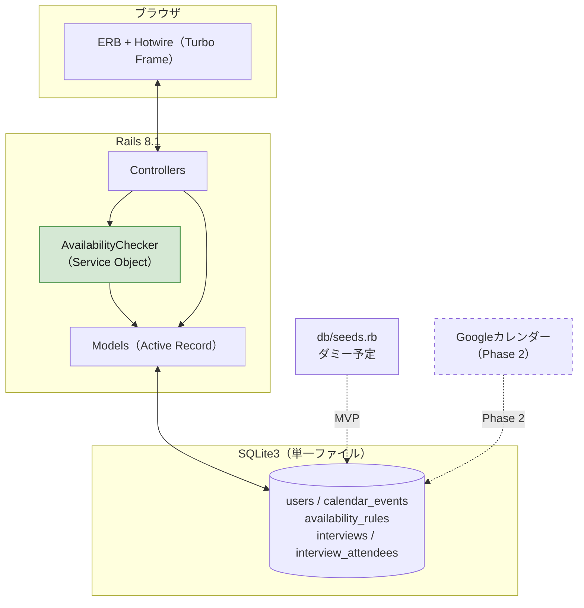
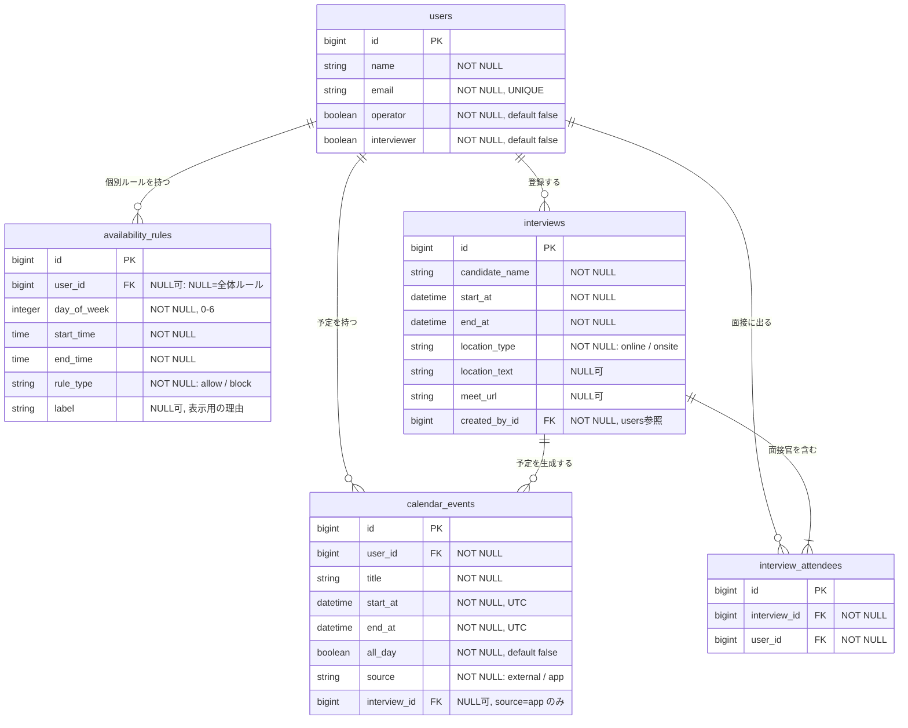
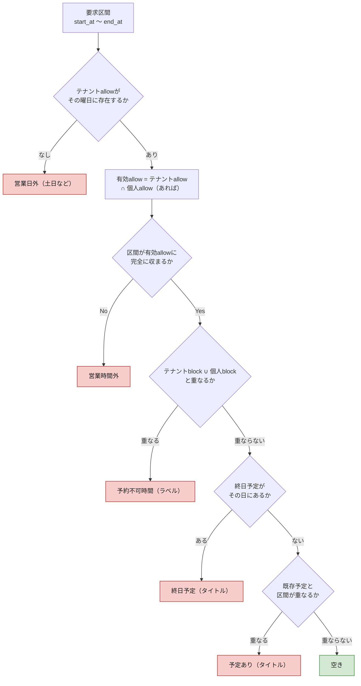
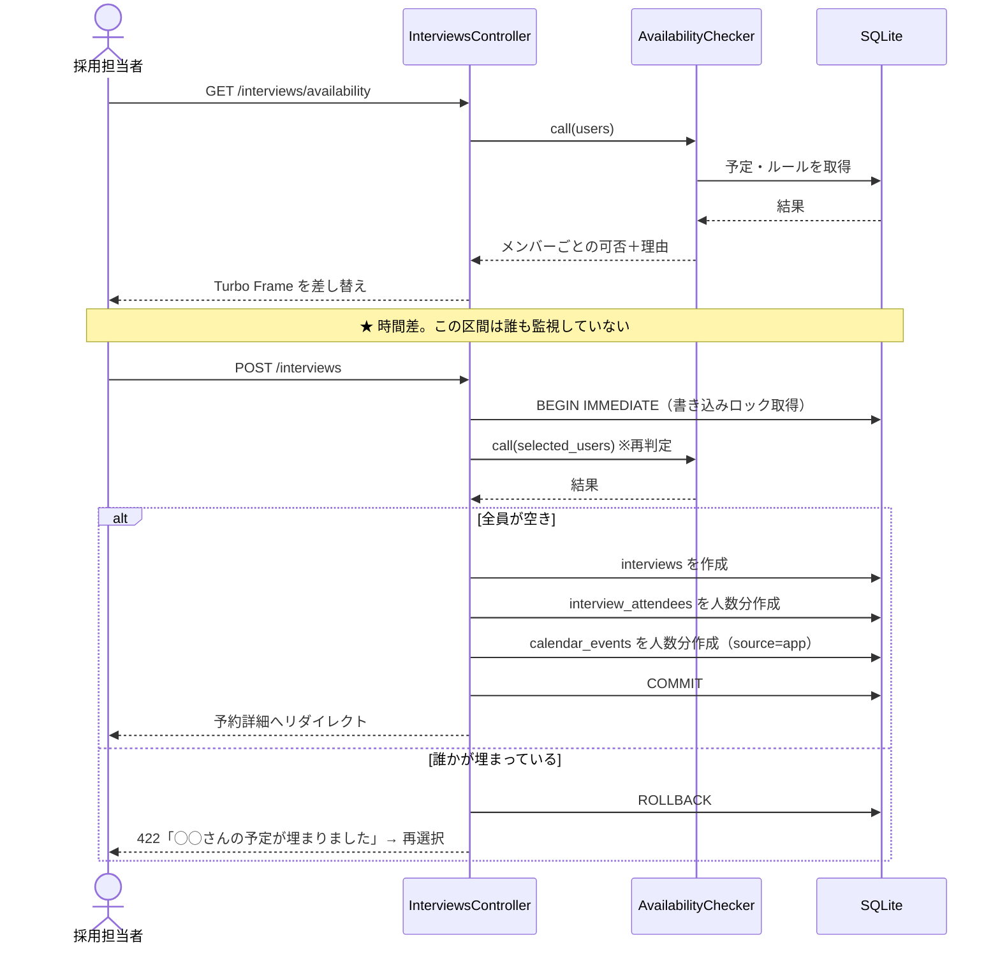
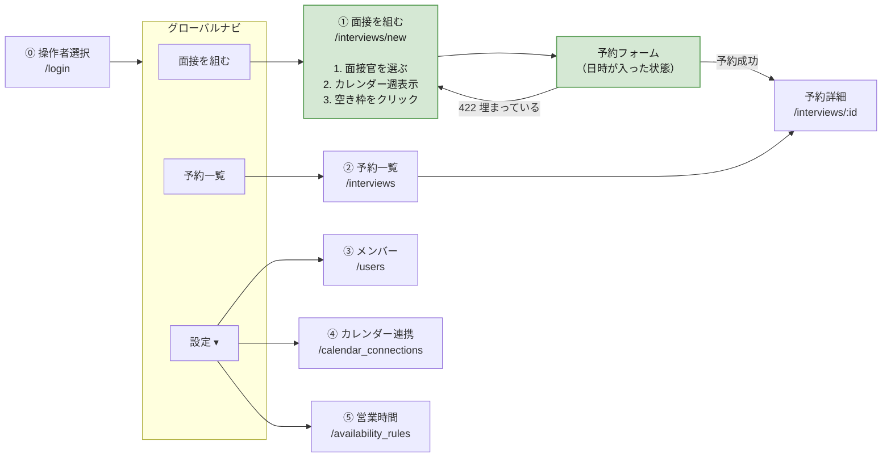
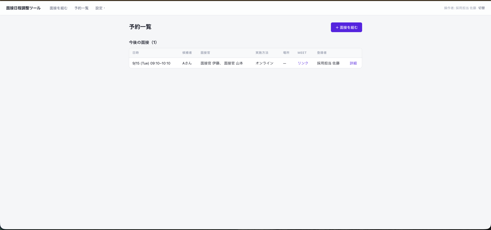
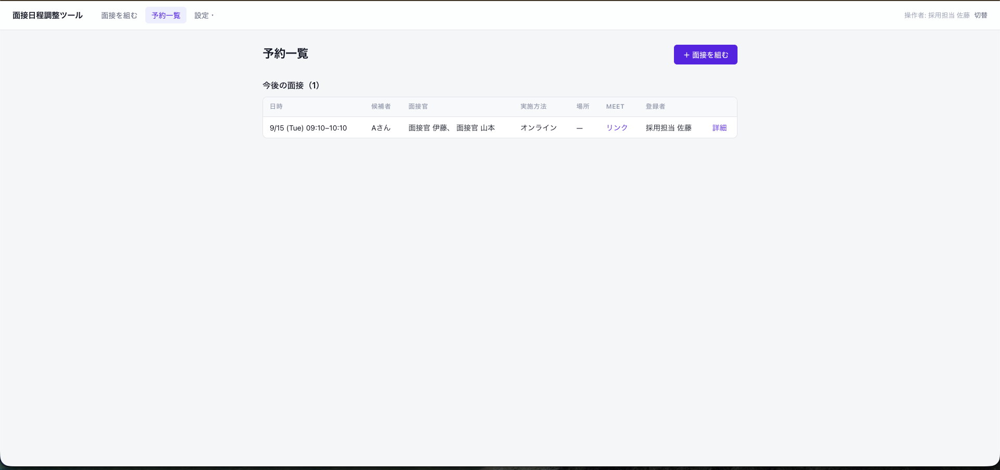
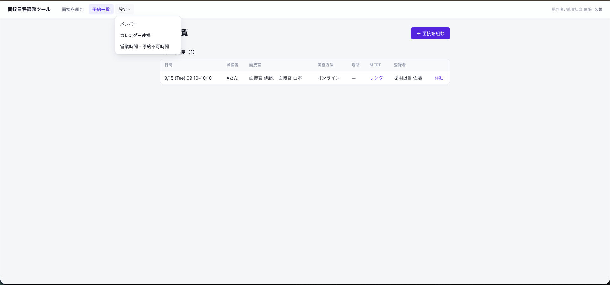

# 面接日程調整ツール 仕様書（MVP / Phase 1）

2026-08-31 ／ Ruby 3.2+ ／ Rails 8.1 ／ SQLite3 ／ Hotwire ／ Minitest
関連文書：要件定義書（Phase別）、別紙A（実装詳細）

**根拠の記号**：`H-nn` = Day 2 ヒヤリング面談／`H2-nn` = 追加ヒヤリング／`A-n` = 置いた仮定

---

## 1. 本ツールが答える問い

データモデルも画面構成も、次の2つの問いから導いている。

```
問1「時刻Tに、誰が空いているか？」
問2「何の面接を、誰と、いつ、どこでやるのか？」
```

問1に答えるには「誰がいるか」「その時間が埋まっているか」「そもそも入れてよい時間か」の3つが要る。問2を記録するには「面接そのもの」と「誰が出るか」の2つが要る。**合わせて5テーブル。これ以上は増えず、これ以下では答えられない。**

### 解決する課題

相談者は候補者からメールで届く希望日時に対し、社内メンバーのカレンダーを一人ずつ開いて確認している。困りごとは「確認の工数」と「予定の重複」の2つだが、**原因は1つで、確認と予約が分断されていること**である。確認した瞬間から登録するまでの間、誰も空き状況を見ていない。

> **本ツールの定義**：指定した時間に空いているメンバーを一覧で示し、確認から予約までを一度の操作で完結させる社内ツール。候補者と面接実施者は本ツールに接触しない。

### 検索の方向

**主動線は「メンバー → カレンダー → 空き枠」である。**

当初は「時間を指定 → 空きメンバーを表示」を主動線としていた。相談文が「時間を指定したら空いているメンバーが分かって、そのまま予約できるもの」であり、H-06 でも「メールから候補日程が来る想定」と確認できたためである。

**H2-05 でこの前提が覆った。** 「そもそも時間で絞るのではなく、参加メンバーのカレンダー一覧を見れて空き時間を検索できる方が便利」との指摘を受け、**主動線を入れ替えた。**

| | 旧（時間 → メンバー） | **新（メンバー → 時間）** |
|---|---|---|
| 起点 | 候補者の希望日時を入力する | **面接官を選ぶ** |
| 次に見るもの | その時間に空いているメンバーの一覧 | **選んだメンバーのカレンダーを週表示** |
| 日時の決め方 | 先に決まっている前提 | **空いている枠を見ながら決める** |
| 全滅した場合 | 「全員×」で終わり、次の行動が示せない | **他の枠が同じ画面に見えている** |

### 入れ替えた理由

旧動線は、**候補者の希望日時が全員埋まっていた場合に行き止まりになる。** 「全員×」と表示して終わりで、次にどの時間を試せばよいかが分からない。日時を変えて検索し直す操作を、当たりが出るまで繰り返すことになる。

これは H-28「その時間、全員埋まっているときは、いまどうしていますか」で質問した内容だが、面談では回答が得られなかった。**H2-05 がその回答にあたる。**

新動線では、**選んだメンバーの空き状況が週単位で一望できる**ため、希望日時が埋まっていても代替候補がその場で見える。現行運用（メンバーのカレンダーを一人ずつ開いて見比べる）を、そのまま1画面に置き換えた形になる。

### 設計への影響

**`AvailabilityChecker` は変更しない。**

判定は「このメンバーは、この区間に空いているか」を答えるだけで、**呼び出し順序を知らない。** 旧動線は区間を固定してメンバーを回し、新動線はメンバーを固定して区間を回す。呼ぶ側のループが変わるだけである。

| 層 | 影響 |
|---|---|
| `AvailabilityChecker` | **なし** |
| データモデル（5テーブル） | **なし** |
| 排他制御（確定直前の再判定） | **なし** |
| 画面①（起点） | **作り直し** |
| ルーティング | 1本追加 |

**主動線の入れ替えという要件変更が、判定ロジックとデータモデルに一切波及しなかった。** 判定を単一クラスに閉じ込め、データを「時間の占有」に正規化していたことの効果である。


---

## 2. システム構成



### 2.1 技術選定の根拠

選定基準は**「Day 7に任意のコードを指されて説明できること」**。使い慣れない技術で書いたコードは、動いても説明できない。

| 層 | 採用 | 根拠 |
|---|---|---|
| Rails 8.1 | フルスタック | 画面・ルーティング・DBが1つの規約に収まる。scaffold でCRUDが数分。**浮いた時間を空き判定ロジックに回す**（§8） |
| SQLite3 | 単一ファイルDB | 下記 |
| Hotwire | Turbo Frame | 検索結果の差し替えに使用。入力値を保持したまま一覧だけ更新できる |
| Service Object | PORO | 空き判定が3テーブルにまたがり、どのモデルにも属さない。かつ検索時と確定時の2箇所から呼ぶ |
| Minitest | Rails標準 | 追加gemなしで境界条件テストを書ける |

### 2.2 SQLiteを選んだ理由

**規模が小さいからではない。データの持ち方が、SQLiteの弱点が表面化しない形をしているため。**

| データの性質 | SQLiteの弱点との関係 |
|---|---|
| 書き込み経路が**Railsアプリ1本に閉じている** | DB側に多重防御を置く必要がない。守るべき別経路が存在しない |
| データ量が**数千件規模**（最大は `calendar_events`） | 性能限界に当たらない |
| **読み中心**（検索は調整のたび／書き込みは1調整につき1回） | SQLiteの弱点は書き込みの直列化。**待ちが発生する場面がない** |
| 利用者が**数名**（採用担当者のみ） | 同時書き込みが起きない |

加えて、**レビュアーが `bin/setup` だけで起動できる**。PostgreSQLだとインストール・起動・接続設定が前提になり、環境差で動かないリスクを負う。動かない成果物は評価されない。

**弱点の認識**：PostgreSQLなら排他制約（`EXCLUDE USING gist`）でDB側にも重複防止を置ける。SQLiteではアプリのトランザクションが唯一の砦になる。今回は書き込み経路が1本なので足りるが、**Phase 2で候補者が直接予約するようになると経路が2本になり、この前提は崩れる**（§9）。

---

## 3. データモデル

### 3.1 ER図



### 3.2 インデックスと制約

| 対象 | 種別 | 目的 |
|---|---|---|
| `users.email` | UNIQUE | 同一人物の二重登録防止 |
| `calendar_events [user_id, start_at]` | 複合 | **空き判定の主クエリ。** `WHERE user_id IN (...) AND start_at < ? AND end_at > ?` |
| `calendar_events.interview_id` | 通常 | 予約キャンセル時の連動削除（Phase 2） |
| `availability_rules [user_id, day_of_week]` | 複合 | ルール引き当て |
| `interviews.start_at` | 通常 | 一覧の日時順ソート |
| `interview_attendees [interview_id, user_id]` | **UNIQUE** | **BR-10（同一メンバーの重複指定禁止）をDB側で担保** |

`end_at > ?` はインデックスを完全には使えないが、数千件規模では実測上問題にならない。件数が桁で増えた場合は、`start_at` の範囲を「当日内」に絞る条件を追加して走査量を減らす。

### 3.3 設計判断

**(1) 予約すると `calendar_events` にも書く**

`interviews` は業務の記録、`calendar_events` は時間の占有で、**別の事実**である。1件の面接から出席者の数だけ占有が生まれるため、件数が違い、同じテーブルには入らない。

書かない場合、次の検索で自ツールが入れた面接が空き判定から漏れ、**自分が入れた予定に自分でダブルブッキングする。**

**(2) 占有を1つの形に正規化する**

埋まる理由（外部予定・面接・将来の会議室予約）はさまざまだが、**空き判定が知りたいのは「埋まっているか」だけ**である。理由ごとにテーブルを分けると同じ重なり判定を何度も書くことになり、追加時に修正漏れが起きる。すべて `calendar_events` に集約し、**判定を1箇所に閉じ込める。**

**(3) `source` カラムの2つの用途**

- **削除の安全性**：キャンセル時に消してよいのは `source = "app"` の行のみ。外部予定を誤って消さない
- **差し替え**：Phase 2 で `external` の生成元をGoogle API取得に置き換えても、判定ロジックは変わらない

**(4) `availability_rules` はテナント全体と個人の2階層で持つ**

`user_id` が NULL ならテナント全体のルール、値があれば個人ルールと判別する。**`scope` カラムは情報を持たない冗長カラムのため置かない。**

H-18の「土日は自動ブロック・テナントでも良いし個別の設定できたら良い」に対応する。**土日ブロックと営業時間はテナント全体のルールとして1組だけ持ち、個人ルールは必要な人にだけ足す。**

**合成規則**（これを決めておかないと実装できない）

| ルール種別 | 合成の仕方 |
|---|---|
| `allow`（予約可能時間） | **テナントの allow が上限。** 個人 allow があればさらにその範囲内に絞る（積集合）。個人 allow が未設定ならテナントの範囲をそのまま使う |
| `block`（予約不可時間） | **テナント block と個人 block の和集合。** どちらか一方にでも重なれば不可 |

**allowは狭める方向、blockは広げる方向にのみ働く。** 個人設定でテナントの制限を緩められない。「全社で土曜は面接しない」と決めたら、個人設定で土曜を開けられないということである。

| 例 | 結果 |
|---|---|
| テナント：平日10-18時 allow ／ 個人：設定なし | 平日10-18時が可能 |
| テナント：平日10-18時 allow ／ 個人：平日13-17時 allow | **平日13-17時のみ可能**（積集合） |
| テナント：平日10-18時 allow ／ 個人：水曜終日 allow | **水曜は不可**（テナントに水曜allowがないため） |
| テナント：12-13時 block ／ 個人：月曜午前 block | 12-13時と月曜午前がいずれも不可（和集合） |

**(5) 候補者をテーブルにしない**

候補者マスタは「この候補者は今どの選考段階か」という管理の入口になり、日程調整ツールから採用管理システムへ範囲が広がる。複数回選考の運用をヒヤリングできていないため文字列に留める。**同一候補者の表記ゆれが起きうることは認識している。**

**(6) 会議名を保存しない**

カレンダーに書き込むタイトルは `"面接：#{candidate_name}様"` の固定フォーマットで生成する。編集可能にすると「なぜ編集が必要か」の要件が別途必要になるため、カラムを持たない。

---

## 4. 中核ロジック：空き判定

### 4.1 判定フロー

`AvailabilityChecker#call` は、メンバーごとに不可理由を返す（空きなら `nil`）。**判定は必ずこの1クラスを通す。**



**不可でも一覧から除外せず、理由を付けて返す。** 相談者は現在、誰がなぜ空いていないかを目視で把握しており、空いている人だけを表示するとその情報が失われる。

### 4.2 開始時刻の刻みと所要時間

**開始時刻の刻み・所要時間ともに固定値を持たず、可変とする。**

H-26の「10分開始など、様々な時間想定で開始できると嬉しい」は開始時刻の話だったが、**15分開始や15分の面接もありうる**という指摘を受け（H2-01）、刻みを固定しない方針に改めた。

| 項目 | 方式 | 理由 |
|---|---|---|
| 開始時刻 | `<input type="time" step="300">`（5分刻み）＋ よく使う時刻のプリセット | **刻みを5分にすれば、10分刻みも15分刻みも30分刻みもすべて表現できる。** 設定機能を作らずに柔軟性が得られる |
| 所要時間 | 数値入力（分）＋ プリセット（15／30／45／60／90分） | 15分の面談から90分の技術面接まで対応。**プリセットは入力補助であり、制約ではない** |

**設定テーブルを設けない理由**：刻みを設定可能にすると、テナント設定の保存先・編集画面・初期値の管理が必要になる。**入力粒度を細かくすれば、設定という概念そのものが不要になる。** 機能を足さずに要求を満たす方を選んだ。

**判定ロジックへの影響はない。** `AvailabilityChecker` は開始時刻と終了時刻を受け取るだけで、刻みの概念を持たない。UIの入力方式が変わるだけである。

これにより、旧版で「一貫していない」と記載していた**開始時刻と所要時間の粒度の不一致は解消する。**

### 4.3 区間の重なり判定

```
既存.start_at < 要求.end_at  AND  既存.end_at > 要求.start_at
```

**等号を含めない（`<=` を使わない）ことで、隣接する予定を「空き」と判定する。** 10:00-11:00 の予定がある人に 11:00-12:00 を入れる場合、`既存.end_at(11:00) > 要求.start_at(11:00)` が偽になり空きとなる。

これは**仮定A-8（面接前後のバッファなし）と1対1で対応している。** バッファが必要になれば、この比較に定数を加算するだけで済む。

### 4.4 テストする境界条件

| # | ケース | 期待 |
|---|---|---|
| 1 | 既存の終了＝要求の開始（隣接） | 空き |
| 2 | 既存の開始＝要求の終了（隣接） | 空き |
| 3 | 既存が要求を完全に含む | 不可 |
| 4 | 要求が既存を完全に含む | 不可 |
| 5 | 前方で部分的に重なる | 不可 |
| 6 | 後方で部分的に重なる | 不可 |
| 7 | 終日予定がある日 | 不可 |
| 8 | 要求終了が営業時間を超える（17:30開始60分／営業18:00まで） | 不可 |
| 9 | 土曜・日曜 | 不可 |
| 10 | 個別blockルールと重なる | 不可（ラベル表示） |
| 11 | **JSTで入力しUTCで保存した予定を、JSTで再判定** | 正しく重なりを検出 |

3〜6は同じ式で処理されるが、**符号の誤りが最も出やすい箇所**のため個別にテストする。11はRails固有の落とし穴で、`Time.zone.parse` の徹底を検証する。

### 4.5 タイムゾーン規約

Active Record は DB に UTC で保存し、`config.time_zone = "Tokyo"` で入出力を変換する。**日程調整アプリでは最大のバグ源**のため、以下を規約とする。

- 現在時刻は `Time.current` のみ。`Time.now` は使わない
- 文字列からの生成は `Time.zone.parse` のみ。`Time.parse` は使わない
- 比較・保存はすべて `ActiveSupport::TimeWithZone` で統一

### 4.6 N+1への対処

`call` はメンバーごとに判定するため、素朴に書くと N+1 になる。`includes(:calendar_events, :availability_rules)` で事前読み込みし、Ruby側で絞り込む。**メンバー数十名の想定ではこれで足りる。** 数百名規模では、1クエリで全予定を取得して `group_by(&:user_id)` する形に変える。

---

## 5. 排他制御

### 5.1 問題の所在

検索結果の表示から予約ボタンを押すまでに時間差があり、その間に他の予定が入りうる。**現行運用で重複が起きているのは、まさにこの時間差が原因**である。表示時のチェックだけでは同じ問題が再現する。



### 5.2 設計方針

**時間差をトランザクションの内側に閉じ込める。** 機能ではなく構造で問題を消す。

| 方針 | 内容 |
|---|---|
| ロック取得のタイミング | `BEGIN IMMEDIATE` で**トランザクション開始時**に書き込みロックを取る。読んでから取るのでは遅い |
| 再判定の範囲 | 選択されたメンバーのみ。全員を再判定する必要はない |
| 失敗時の粒度 | **1名でも不可なら予約全体を中止。** 部分的に予定が入った中途半端な状態を作らない |
| 判定ロジック | 検索時とまったく同じ `AvailabilityChecker` を呼ぶ。**分岐させない** |

`isolation: :immediate` の対応可否は Rails 8.1 の SQLite3 アダプタで実装時に検証する。非対応の場合は `connection.execute("BEGIN IMMEDIATE")` を直接発行する。

### 5.3 PostgreSQL移行時（Phase 2）

書き込みが直列化されないため、以下のいずれかが必要になる。

**(a) 行ロック**：`User.where(id: ids).order(:id).lock` で対象行をロック。**IDの昇順で取ることでデッドロックを回避する。**

**(b) 排他制約（推奨）**：

```sql
ALTER TABLE calendar_events
  ADD CONSTRAINT no_overlap
  EXCLUDE USING gist (user_id WITH =, tsrange(start_at, end_at) WITH &&)
  WHERE (all_day = false);
```

アプリ側の再判定はユーザー向けエラーメッセージのために残し、**最終的な保証をDBに置く。**

> **Rails固有の注意**：排他制約は `db/schema.rb` で表現できない。`config.active_record.schema_format = :sql` に切り替えて `db/structure.sql` で管理する。忘れると `db:schema:load` で環境を再構築した際に制約が消える。

---

## 6. 画面仕様

### 6.1 登場人物

「ツールを操作するか」「空き判定の対象になるか」の2軸で整理する。

| 登場人物 | 操作 | 空き判定の対象 | データの持ち方 |
|---|---|---|---|
| **採用担当者**（複数人） | ○ | △ 兼任しうる | `users.operator = true` |
| **面接実施者** | × | ○ | `users.interviewer = true` |
| **面談候補者** | × | × | `interviews.candidate_name` |

**採用担当者が自分で面接に出るケースがあるため、両者を別テーブルにしない。** 分けると兼任者が2レコードに分かれ、氏名の二重管理が発生する。**役割ではなく「できること」をフラグで持つ。**

| | `operator` | `interviewer` |
|---|---|---|
| 採用担当で面接にも出る | true | true |
| 採用担当で調整専門 | true | false |
| 面接だけ出る社内メンバー | false | true |

ヒヤリングで挙がった「管理者とCA」の権限差は確認できていない（仮定A-6）。**Phase 1 では権限差を実装せず、`operator = true` の1種類として扱う。**

### 6.2 簡易ログインの実装

**パスワード認証を行わない。操作者を選択してセッションに保持するだけの仕組みである。**

```ruby
# app/controllers/sessions_controller.rb
class SessionsController < ApplicationController
  skip_before_action :require_operator, only: %i[new create]

  def new                      # GET /login
    @operators = User.where(operator: true).order(:name)
  end

  def create                   # POST /login
    user = User.find_by(id: params[:user_id], operator: true)
    if user
      session[:user_id] = user.id
      redirect_to root_path
    else
      redirect_to login_path, alert: "操作者を選択してください"
    end
  end
end
```

```ruby
# app/controllers/application_controller.rb
class ApplicationController < ActionController::Base
  before_action :require_operator
  helper_method :current_user

  private

  def current_user
    @current_user ||= User.find_by(id: session[:user_id], operator: true)
  end

  def require_operator
    redirect_to login_path unless current_user
  end
end
```

| 項目 | 内容 |
|---|---|
| 選択肢 | `operator = true` のメンバーのみ |
| 保持先 | Rails のセッション（Cookie に署名付きで保存） |
| 有効範囲 | ブラウザを閉じるまで。**「切替」でいつでも変更できる** |
| 用途 | `interviews.created_by_id` への記録、および画面右上の表示 |
| 未ログイン時 | `before_action` で全画面から `/login` へリダイレクト |

**`User.find_by(id: ..., operator: true)` と条件を2つ課している理由**：セッションのIDだけで引くと、**後から `operator` を false に変更されたユーザーがログインしたままになる。** 毎回 `operator` を確認することで、権限を落とした瞬間から操作できなくなる。

**セキュリティ上の位置づけ**：`user_id` を選ぶだけなので、**他人になりすませる。** 社内ツールであり本番データを扱わないため、Phase 1 では許容する。Phase 2 で F-52（認証・権限制御）として実装する。**この判断は明示的であり、実装漏れではない。**

### 6.3 画面遷移



**ナビは使用頻度で構成している。** 日常的に繰り返し使う「面接を組む」「予約一覧」を第一階層に置き、初期設定に属する③④⑤を設定メニューに集約する。

**権限による出し分けは行っていない。** 管理者とCAの違いをヒヤリングできていないため（仮定A-6）。右上に現在の操作者と「切替」を常時表示する。

### 6.4 実装画面

#### 面接を組む（画面①）



日付・開始時刻（時＋分の2段選択）・所要時間を指定して「空きメンバーを表示」を押すと、下部に判定結果が Turbo Frame で差し込まれる。**候補者名と日時の入力値は差し替え後も保持される。**

分の選択肢を `:00 / :10 / :20 / :30 / :40 / :50` としているのは BR-08（開始時刻は10分刻み）に対応する。

> **このスクリーンショットは主動線の入れ替え前（H2-05 以前）のものである。** 日時を先に指定して空きメンバーを表示する旧動線を写している。新動線では面接官を先に選び、週カレンダーから空き枠をクリックする形になる（§6.6）。**入れ替えの前後を対比する資料として残している。**

#### 予約一覧（画面②）



**登録者で絞り込まず、全件を共有表示する**（§6.7）。「登録者」列に `created_by_id` が表示され、複数人運用で問い合わせ先が分かる。

見出しが「今後の面接（1）」となっているとおり、**表示対象は今後分のみ**である。過去分はデータとカレンダー上の占有として残るが、参照画面は設けていない（§9.1）。

#### グローバルナビと設定メニュー



**使用頻度で構成している。** 日常的に繰り返し使う「面接を組む」「予約一覧」を第一階層に置き、初期設定に属する「メンバー」「カレンダー連携」「営業時間・予約不可時間」を設定メニューに集約した。

**権限による出し分けは行っていない。** 管理者とCAの違いをヒヤリングできていないため（仮定A-6）、設定メニューも全操作者が開ける。右上に現在の操作者と「切替」を常時表示し、誰として操作しているかを画面上で確認できるようにしている。

### 6.5 各画面の入出力

| # | 画面 | 誰が | 入力 | 出力 | 優先度 |
|---|---|---|---|---|---|
| ⓪ | 操作者選択 | 採用担当者 | `operator = true` のメンバーから自分を選択 | セッションに `user_id` を保持 | Must |
| ① | **面接を組む** | 採用担当者 | 面接官（1〜N名）／週の起点日／所要時間 | **選択メンバーのカレンダー週表示。空き枠をクリックして予約フォームへ** | Must |
| ①b | 予約フォーム | 採用担当者 | 候補者名／実施方法／場所／会議URL（日時と面接官は①から引き継ぐ） | 予約確定 | Must |
| ② | 予約一覧 | 採用担当者 | （なし） | 今後の面接を日時昇順で表示 | Must |
| ③ | メンバー | 採用担当者 | 氏名／メール／`operator`／`interviewer` | メンバー一覧 | Must |
| ④ | カレンダー連携 | 採用担当者 | — | ダミーカレンダーの接続状態。**Phase 2でOAuth接続に置き換わる** | 実装中に追加 |
| ⑤ | 営業時間 | 採用担当者 | 曜日／時間帯／allow・block／ラベル | ルール一覧 | Should |

> **④は設計時に定義しておらず、実装中に追加した画面である。** Phase 2 のGoogle連携の受け皿を先に置いた形になっており、判断メモに記載する。

### 6.6 画面①の操作フロー

**正常系**

| # | 操作 | 応答 |
|---|---|---|
| 1 | 面接官を1〜N名チェック | — |
| 2 | 所要時間を指定（分。プリセット 15／30／45／60／90） | — |
| 3 | 週を選ぶ（既定は今週。前後へ移動可） | Turbo Frame でカレンダー部分のみ差し替え |
| 4 | カレンダーを確認 | **選択メンバー全員の予定を重ねた週表示**（下表） |
| 5 | 空き枠をクリック | 日時・面接官が入った予約フォームを開く |
| 6 | 候補者名・実施方法・場所・会議URLを入力 | — |
| 7 | 「予約する」 | 確定直前に再判定 → 成功なら予約詳細へ |

**手順4の表示仕様**

選択したメンバーの予定を**1つのカレンダーに重ねて表示する。** 個人ごとに列を分けない。理由は、**探しているのは「全員が空いている枠」**であり、誰か1人でも埋まっていればその枠は使えないためである。

| 状態 | 表示 | 補足 |
|---|---|---|
| 全員空き | **クリックできる枠** | 所要時間分の長さで表示 |
| 誰かに予定あり | 灰色のブロック | **誰の何の予定かをラベル表示**（例：伊藤／部門定例） |
| 営業時間外・営業日外 | 背景をグレーアウト | 枠を描かない |
| 予約不可時間 | 斜線パターン | ラベルを表示（例：昼休み） |

**埋まっている理由と対象者を出す**のは旧動線から引き継いだ方針である。相談者は現在、誰がなぜ空いていないかを目視で把握しており、単に「使えない」とだけ示すとその情報が失われる。

**例外系**

| 発生箇所 | 事象 | 挙動 |
|---|---|---|
| 手順1 | `interviewer = true` のメンバーが未登録 | メンバー画面への導線を表示 |
| 手順1 | 面接官が1名も選ばれていない | カレンダーを表示せず、選択を促す |
| 手順4 | その週に空き枠が1つもない | **「この週に全員が空く枠はありません」と表示し、翌週への導線を出す** |
| 手順7 | 選択メンバーが埋まった | **予約全体を中止**し、対象者名を示して手順4へ戻す |
| 手順7 | 必須項目が未入力 | 該当項目にエラー。**日時と面接官の選択は保持する** |

**空き枠の算出**

週の各日について、営業時間内を所要時間の長さで走査し、**`AvailabilityChecker` が選択メンバー全員に対して空きを返す区間**を枠とする。走査の刻みは5分（BR-08）。

```
for 日 in 週の各日:
  for 開始 in 営業時間を5分刻みで走査:
    区間 = 開始 〜 開始 + 所要時間
    if AvailabilityChecker が全員 available:
      空き枠として描画
```

**判定そのものは既存クラスをそのまま呼ぶ。** 呼び出し回数が増えるだけである。

**性能について**：週5日 × 営業8時間 × 5分刻み = 480区間、これをメンバー数分判定する。**予定データは `includes` で事前読み込みしてメモリ上で判定する**ため、DBへの問い合わせは週あたり数回で済む（§4.6）。区間ごとにDBを叩くと480回になるため、ここは事前読み込みが前提となる。

### 6.7 予約の可視性

**予約一覧は登録者で絞り込まない。全件を共有して表示する。** ヒヤリングNo.2で「自分の予定でなくても誰でも入れられるようにしたい」とあり、担当者間で共有する前提のため。自分の分しか見えないと代理対応ができない。

`created_by_id` は**記録および表示のために保持**しており、絞り込みには使用していない。

---

## 7. ルーティング

```ruby
Rails.application.routes.draw do
  root "interviews#new"

  get  "login",  to: "sessions#new"
  post "login",  to: "sessions#create"

  resources :interviews, only: %i[index new create show] do
    collection do
      get :calendar   # Turbo Frame で選択メンバーの週カレンダーを返す
    end
  end

  resources :users
  resources :calendar_connections, only: %i[index]
  resource  :availability_rules,   only: %i[show update]
end
```

| メソッド | パス | 用途 |
|---|---|---|
| GET | `/login` | 操作者選択 |
| GET | `/interviews/new` | 面接を組む（面接官選択＋週カレンダー） |
| GET | `/interviews/calendar?user_ids[]=&week_of=&duration=` | 選択メンバーの週カレンダー（Turbo Frame） |
| POST | `/interviews` | 予約確定（再判定つき）。競合時 422 |
| GET | `/interviews` `/interviews/:id` | 一覧・詳細 |
| — | `/users` 一式 | メンバー管理 |
| GET | `/calendar_connections` | カレンダー連携状態 |
| GET/PATCH | `/availability_rules` | 営業時間・予約不可時間 |

`calendar` は `_week_grid.html.erb` パーシャルを返す。**空き枠だけでなく、埋まっている区間も「誰の何の予定か」を付けて渡す。** 表示側で消すかどうかを判断できるようにするためである。

---

## 8. 実装順と時間配分

想定10〜15時間のうち設計に約4時間。**残り約9時間の配分。**

| 順 | 内容 | 想定 | 理由 |
|---|---|---|---|
| 1 | `rails new`・モデル・マイグレーション・seed | 1.0h | 判定ロジックを試すデータが先に要る |
| 2 | 簡易ログイン（セッションに `user_id`） | 0.5h | `created_by_id` を埋めるのに必要 |
| 3 | **`AvailabilityChecker` ＋ 単体テスト** | 2.5h | 心臓部。画面より先に作り、境界条件（§4.3）をテストで固める |
| 4 | **画面①（週カレンダー＋空き枠算出）** | 2.5h | 主動線。`AvailabilityChecker` を週の全区間に対して呼び、空き枠を描画する |
| 5 | **予約フォーム＋確定＋再判定** | 1.5h | 空き枠クリックから予約確定まで。**ここまでで価値が出る** |
| 6 | 画面②（一覧・詳細） | 0.5h | scaffold をベースに整形 |
| 7 | 画面③（メンバー） | 0.5h | seed で代用できるため後回し |
| 8 | README・判断メモ | 1.0h | **時間切れでも必ず確保する** |
| — | *画面④⑤・Meet URL* | *1.0h* | *残り時間の分だけ* |

**scaffold で5・6を計1.0時間まで削り、その分を3に上乗せしている。** 判定ロジックが誤っていればどんな画面を作っても意味がない。**フレームワーク選定が時間配分を変えた**ということである。

**3を1番目にしない理由**：判定ロジックはスキーマに依存するため、先にマイグレーションを固めないと手戻りになる。

**撤退ライン**：5まで完了していれば相談者の困りごとは解決している。6以降が未実装でも、READMEに明記のうえ「1画面について語れる」状態を優先する。

---

## 9. 既知の制約と未対応事項

**設計上の判断として残しているものと、実装が追いついていないものを分けて記載する。**

### 9.1 判断として残しているもの

| # | 内容 | 判断理由 |
|---|---|---|
| 1 | 「動かせる予定」を区別しない（仮定A-1） | 調整可能かを機械的に判定する手段がない。ヒヤリングNo.17が未回答 |
| 2 | 過去の面接を参照する画面がない | 一覧は今後分のみ。**データとカレンダー上の占有は残る。** 後から見返す運用をヒヤリングできていない（No.36が未回答） |
| 3 | 実施済み・キャンセル等の状態を持たない | 状態管理は選考管理システムの領域。境界の外と判断 |
| 4 | 認証が簡易（パスワードなし） | 社内ツールで権限差の要求もない。**なりすまし可能であることは認識している** |
| 5 | タイムゾーンをJST固定 | 社内利用のため |
| 6 | 祝日を扱わない | 祝日マスタの調達方法をヒヤリングできていない |
| 7 | **カレンダー予定の投入は seed と手入力のみ** | H-15で「ダミーデータで再現して、同期された前提で進めて良い」と合意済み。**予定を保持し判定に使えるところまでを範囲とし、取り込み・同期処理は実装しない。** Google連携は Phase 2（F-41） |
| 8 | 空き枠の自動抽出を行わない | 画面⑥は予定を一覧表示するのみで、条件に合う枠の機械的な列挙は Phase 2。現行運用が目視判断のため、一覧化だけで工数は削減される |

### 9.2 解消済み・対応中の指摘

| # | 指摘 | 対応 |
|---|---|---|
| 1 | 所要時間が3択なのに開始時刻は10分刻みで、粒度が一貫していない | **解消。** §4.2 で開始時刻を5分刻み、所要時間を数値入力に変更し、固定値を持たない方針に改めた |
| 2 | 開始時刻の選択肢が08〜20時なのに営業時間は10〜18時で、必ず失敗する選択肢がある | **対応中。** 時刻を自由入力にすることで選択肢の概念がなくなる。ただし営業時間外の入力に対する事前警告は未実装で、判定結果の「営業時間外」で気づく形になる |
| 3 | 候補者の希望日時が全滅したとき、次の行動を示せない | **対応中。** 画面⑥（メンバーカレンダー）を追加。ただし空き枠の自動抽出は Phase 2 |

### 9.3 実装で確認すべき事項

| # | 確認事項 | 想定される問題 |
|---|---|---|
| 1 | **過去日時での予約が可能になっていないか** | 空き判定は「予定と重なるか」しか見ておらず、過去日を指定すると全員空きと出る可能性がある。バリデーション1行で対処可能 |
| 2 | `transaction(isolation: :immediate)` の動作 | Rails 8.1 のSQLite3アダプタでの対応可否。非対応なら `BEGIN IMMEDIATE` を直接発行 |
| 3 | `db/*.sqlite3` が `.gitignore` に入っているか | DBファイルの混入は「本番データをGitに上げる人」に見える |
| 4 | scaffold 生成コードを全て読んだか | **生成物も「自分が書いたコード」として質問される** |

---

## 10. Phase 2 で必要になる変更

| 変更 | 影響範囲 | 大きさ |
|---|---|---|
| Googleカレンダー実連携 | `source = "external"` の生成をAPI取得に差し替え。**`AvailabilityChecker` は変更しない**。ただし `calendar_events` に **`external_event_id`（Google側のイベントID）が必要**。これがないとキャンセル時にGoogle側を削除できない | 中 |
| 管理者画面の分離 | `users` にロール列を追加し、`before_action` で制御。**権限差の定義をヒヤリングで確定させることが前提** | 小 |
| 候補者が直接枠を選ぶ | 公開画面・URLトークン・**仮押さえ状態**（`interviews.status`）・排他制御。**書き込み経路が2本になるため、SQLiteの前提が崩れる（§2.2）** | 大 |
| 予約の変更・キャンセル | `calendar_events` の連動削除。`source` と `interview_id` があるため実装は素直 | 小 |
| 面接官の承諾フロー | 「確定で良い」の前提が覆る。**予約確定＝カレンダー書き込み、という設計を分解する必要がある** | 大 |
| 会議室の予約 | 会議室を空き判定の対象リソースとして抽象化。`AvailabilityChecker` の対象を User からリソースへ一般化 | 中 |

### 外部API連携時のトランザクション境界

**Googleへの書き込みはDBトランザクションに含められない。** ロールバックしても、既に作成されたGoogleイベントは消えない。逆にGoogle書き込みだけ成功してDBがロールバックすると、誰の予定でもない予定がカレンダーに残る。

| 事象 | 結果 |
|---|---|
| Google書き込みが失敗 | システムは予約済み、Googleは空き |
| 面接官が自分で削除・移動 | システムが知らないまま |
| 自ツール製イベントを識別できない | 後から更新・削除できない → `external_event_id` が必要 |

**対処方針**：空き判定の正をローカルの `calendar_events` に置き続け、Googleへの書き込みは「確定後に非同期で反映し、失敗時は再送する」扱いとする。**判定の正しさが外部APIの成否に引きずられない構造を保つ。**

ローカルを持たずGoogleのみを参照する設計にすると、判定と書き込みの間をトランザクションで囲めず、**現在の重複防止が成立しなくなる。**
