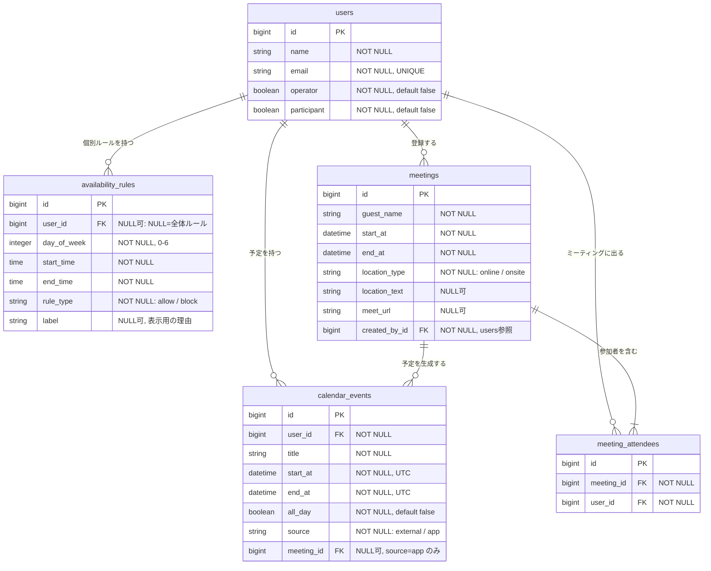
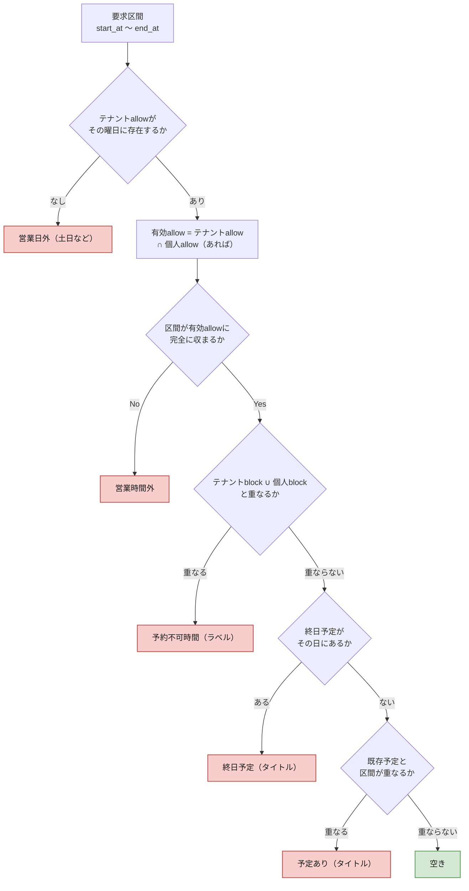
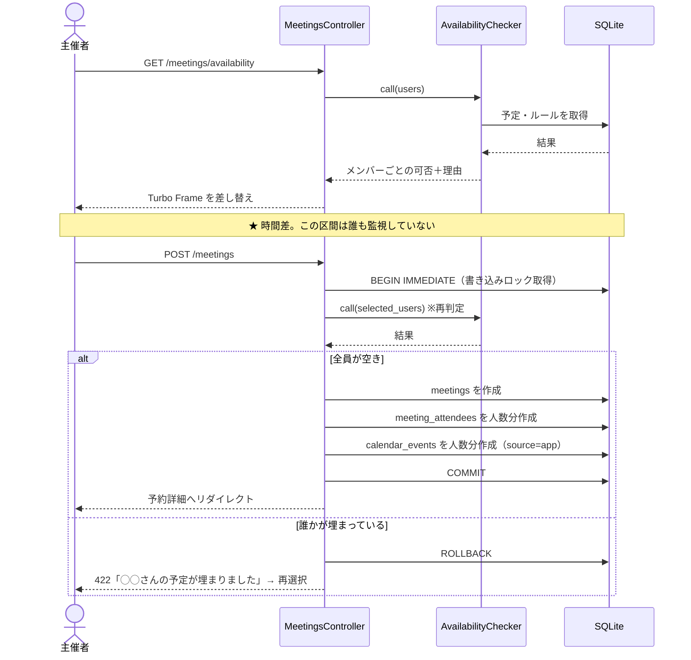
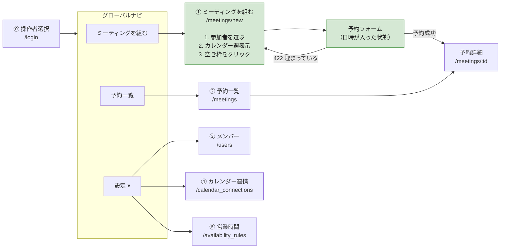
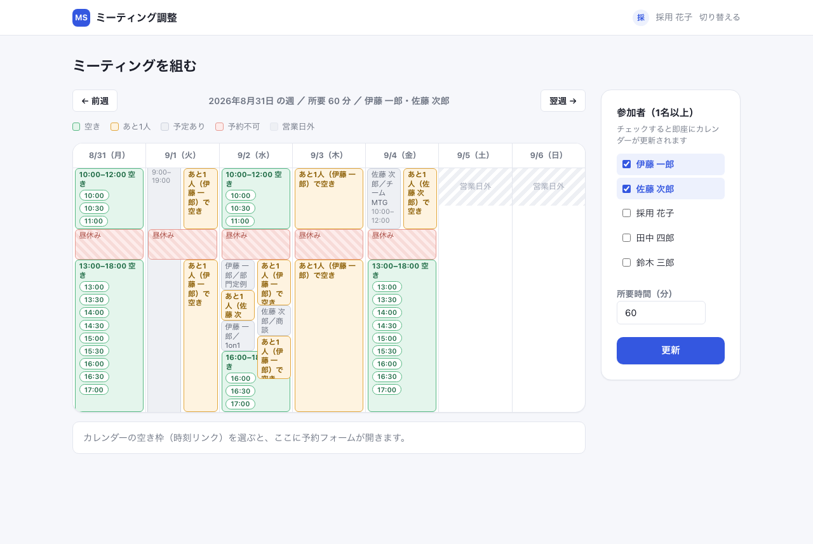
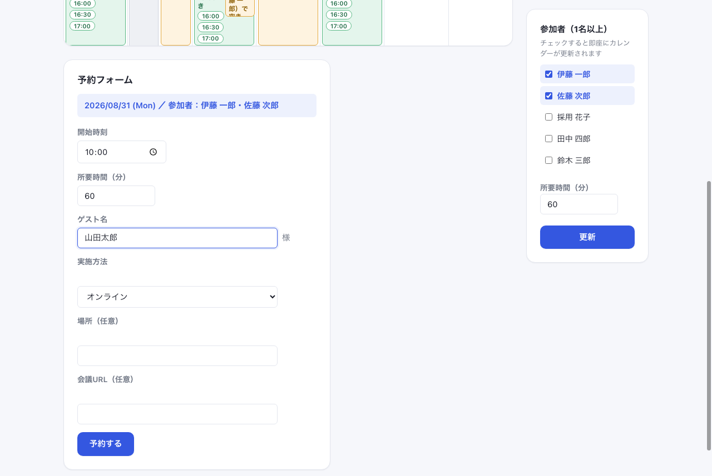

# ミーティング調整ツール 仕様書（MVP / Phase 1）

2026-08-31 初版 ／ 2026-09-02 改訂（画面①実装・UI刷新・用語統一〔面接→ミーティング／候補者→ゲスト／面接官→参加者／採用担当者→主催者〕を反映） ／ Ruby 3.2+ ／ Rails 8.1 ／ SQLite3 ／ Hotwire ／ Minitest
関連文書：要件定義書（Phase別）、別紙A（実装詳細）

**根拠の記号**：`H-nn` = Day 2 ヒヤリング面談／`H2-nn` = 追加ヒヤリング／`A-n` = 置いた仮定

---

## 1. 本ツールが答える問い

データモデルも画面構成も、次の2つの問いから導いている。

```
問1「時刻Tに、誰が空いているか？」
問2「何のミーティングを、誰と、いつ、どこでやるのか？」
```

問1に答えるには「誰がいるか」「その時間が埋まっているか」「そもそも入れてよい時間か」の3つが要る。問2を記録するには「ミーティングそのもの」と「誰が出るか」の2つが要る。**合わせて5テーブル。これ以上は増えず、これ以下では答えられない。**

### 解決する課題

相談者はゲストからメールで届く希望日時に対し、社内メンバーのカレンダーを一人ずつ開いて確認している。困りごとは「確認の工数」と「予定の重複」の2つだが、**原因は1つで、確認と予約が分断されていること**である。確認した瞬間から登録するまでの間、誰も空き状況を見ていない。

> **本ツールの定義**：指定した時間に空いているメンバーを一覧で示し、確認から予約までを一度の操作で完結させる社内ツール。ゲストと参加者は本ツールに接触しない。

### 検索の方向

**主動線は「メンバー → カレンダー → 空き枠」である。**

当初は「時間を指定 → 空きメンバーを表示」を主動線としていた。相談文が「時間を指定したら空いているメンバーが分かって、そのまま予約できるもの」であり、H-06 でも「メールから候補日程が来る想定」と確認できたためである。

**H2-05 でこの前提が覆った。** 「そもそも時間で絞るのではなく、参加メンバーのカレンダー一覧を見れて空き時間を検索できる方が便利」との指摘を受け、**主動線を入れ替えた。**

| | 旧（時間 → メンバー） | **新（メンバー → 時間）** |
|---|---|---|
| 起点 | ゲストの希望日時を入力する | **参加者を選ぶ** |
| 次に見るもの | その時間に空いているメンバーの一覧 | **選んだメンバーのカレンダーを週表示** |
| 日時の決め方 | 先に決まっている前提 | **空いている枠を見ながら決める** |
| 全滅した場合 | 「全員×」で終わり、次の行動が示せない | **他の枠が同じ画面に見えている** |

### 入れ替えた理由

旧動線は、**ゲストの希望日時が全員埋まっていた場合に行き止まりになる。** 「全員×」と表示して終わりで、次にどの時間を試せばよいかが分からない。日時を変えて検索し直す操作を、当たりが出るまで繰り返すことになる。

これは H-28「その時間、全員埋まっているときは、いまどうしていますか」で質問した内容だが、面談では回答が得られなかった。**H2-05 がその回答にあたる。**

新動線では、**選んだメンバーの空き状況が週単位で一望できる**ため、希望日時が埋まっていても代替候補がその場で見える。現行運用（メンバーのカレンダーを一人ずつ開いて見比べる）を、そのまま1画面に置き換えた形になる。

### 設計への影響

**`AvailabilityChecker` は変更しない。**

判定は「このメンバーは、この区間に空いているか」を答えるだけで、**呼び出し順序を知らない。** 旧動線は区間を固定してメンバーを回し、新動線はメンバーを固定して区間を回す。呼ぶ側のループが変わるだけである。

| 層 | 影響 |
|---|---|
| `AvailabilityChecker` | **なし** |
| データモデル（5テーブル） | **なし** |
| 排他制御（確定直前の再判定） | **なし** |
| 画面①（起点） | **作り直し** |
| ルーティング | 1本追加 |

**主動線の入れ替えという要件変更が、判定ロジックとデータモデルに一切波及しなかった。** 判定を単一クラスに閉じ込め、データを「時間の占有」に正規化していたことの効果である。


---

## 2. システム構成


### 2.1 技術選定の根拠

選定基準は**「Day 7に任意のコードを指されて説明できること」**。使い慣れない技術で書いたコードは、動いても説明できない。

| 層 | 採用 | 根拠 |
|---|---|---|
| Rails 8.1 | フルスタック | 画面・ルーティング・DBが1つの規約に収まる。scaffold でCRUDが数分。**浮いた時間を空き判定ロジックに回す**（§8） |
| SQLite3 | 単一ファイルDB | 下記 |
| Hotwire | Turbo Frame | 検索結果の差し替えに使用。入力値を保持したまま一覧だけ更新できる |
| Service Object | PORO | 空き判定が3テーブルにまたがり、どのモデルにも属さない。かつ検索時と確定時の2箇所から呼ぶ |
| Minitest | Rails標準 | 追加gemなしで境界条件テストを書ける |

### 2.2 SQLiteを選んだ理由

**規模が小さいからではない。データの持ち方が、SQLiteの弱点が表面化しない形をしているため。**

| データの性質 | SQLiteの弱点との関係 |
|---|---|
| 書き込み経路が**Railsアプリ1本に閉じている** | DB側に多重防御を置く必要がない。守るべき別経路が存在しない |
| データ量が**数千件規模**（最大は `calendar_events`） | 性能限界に当たらない |
| **読み中心**（検索は調整のたび／書き込みは1調整につき1回） | SQLiteの弱点は書き込みの直列化。**待ちが発生する場面がない** |
| 利用者が**数名**（主催者のみ） | 同時書き込みが起きない |

加えて、**レビュアーが `bin/setup` だけで起動できる**。PostgreSQLだとインストール・起動・接続設定が前提になり、環境差で動かないリスクを負う。動かない成果物は評価されない。

**弱点の認識**：PostgreSQLなら排他制約（`EXCLUDE USING gist`）でDB側にも重複防止を置ける。SQLiteではアプリのトランザクションが唯一の砦になる。今回は書き込み経路が1本なので足りるが、**Phase 2でゲストが直接予約するようになると経路が2本になり、この前提は崩れる**（§9）。

---

## 3. データモデル

### 3.1 ER図



### 3.2 インデックスと制約

| 対象 | 種別 | 目的 |
|---|---|---|
| `users.email` | UNIQUE | 同一人物の二重登録防止 |
| `calendar_events [user_id, start_at]` | 複合 | **空き判定の主クエリ。** `WHERE user_id IN (...) AND start_at < ? AND end_at > ?` |
| `calendar_events.meeting_id` | 通常 | 予約キャンセル時の連動削除（Phase 2） |
| `availability_rules [user_id, day_of_week]` | 複合 | ルール引き当て |
| `meetings.start_at` | 通常 | 一覧の日時順ソート |
| `meeting_attendees [meeting_id, user_id]` | **UNIQUE** | **BR-10（同一メンバーの重複指定禁止）をDB側で担保** |

`end_at > ?` はインデックスを完全には使えないが、数千件規模では実測上問題にならない。件数が桁で増えた場合は、`start_at` の範囲を「当日内」に絞る条件を追加して走査量を減らす。

### 3.3 設計判断

**(1) 予約すると `calendar_events` にも書く**

`meetings` は業務の記録、`calendar_events` は時間の占有で、**別の事実**である。1件のミーティングから出席者の数だけ占有が生まれるため、件数が違い、同じテーブルには入らない。

書かない場合、次の検索で自ツールが入れたミーティングが空き判定から漏れ、**自分が入れた予定に自分でダブルブッキングする。**

**(2) 占有を1つの形に正規化する**

埋まる理由（外部予定・ミーティング・将来の会議室予約）はさまざまだが、**空き判定が知りたいのは「埋まっているか」だけ**である。理由ごとにテーブルを分けると同じ重なり判定を何度も書くことになり、追加時に修正漏れが起きる。すべて `calendar_events` に集約し、**判定を1箇所に閉じ込める。**

**(3) `source` カラムの2つの用途**

- **削除の安全性**：キャンセル時に消してよいのは `source = "app"` の行のみ。外部予定を誤って消さない
- **差し替え**：Phase 2 で `external` の生成元をGoogle API取得に置き換えても、判定ロジックは変わらない

**(4) `availability_rules` はテナント全体と個人の2階層で持つ**

`user_id` が NULL ならテナント全体のルール、値があれば個人ルールと判別する。**`scope` カラムは情報を持たない冗長カラムのため置かない。**

H-18の「土日は自動ブロック・テナントでも良いし個別の設定できたら良い」に対応する。**土日ブロックと営業時間はテナント全体のルールとして1組だけ持ち、個人ルールは必要な人にだけ足す。**

**合成規則**（これを決めておかないと実装できない）

| ルール種別 | 合成の仕方 |
|---|---|
| `allow`（予約可能時間） | **テナントの allow が上限。** 個人 allow があればさらにその範囲内に絞る（積集合）。個人 allow が未設定ならテナントの範囲をそのまま使う |
| `block`（予約不可時間） | **テナント block と個人 block の和集合。** どちらか一方にでも重なれば不可 |

**allowは狭める方向、blockは広げる方向にのみ働く。** 個人設定でテナントの制限を緩められない。「全社で土曜はミーティングを入れない」と決めたら、個人設定で土曜を開けられないということである。

| 例 | 結果 |
|---|---|
| テナント：平日10-18時 allow ／ 個人：設定なし | 平日10-18時が可能 |
| テナント：平日10-18時 allow ／ 個人：平日13-17時 allow | **平日13-17時のみ可能**（積集合） |
| テナント：平日10-18時 allow ／ 個人：水曜終日 allow | **水曜は不可**（テナントに水曜allowがないため） |
| テナント：12-13時 block ／ 個人：月曜午前 block | 12-13時と月曜午前がいずれも不可（和集合） |

**(5) ゲストをテーブルにしない**

ゲストマスタは「このゲストは今どの案件のどの段階か」という管理の入口になり、日程調整ツールから案件管理システムへ範囲が広がる。複数回のやり取りを前提とした運用をヒヤリングできていないため文字列に留める。**同一ゲストの表記ゆれが起きうることは認識している。**

**(6) 会議名を保存しない**

カレンダーに書き込むタイトルは `"ミーティング：#{guest_name}様"` の固定フォーマットで生成する。編集可能にすると「なぜ編集が必要か」の要件が別途必要になるため、カラムを持たない。

---

## 4. 中核ロジック：空き判定

### 4.1 判定フロー

`AvailabilityChecker#call` は、メンバーごとに不可理由を返す（空きなら `nil`）。**判定は必ずこの1クラスを通す。**



**不可でも一覧から除外せず、理由を付けて返す。** 相談者は現在、誰がなぜ空いていないかを目視で把握しており、空いている人だけを表示するとその情報が失われる。

### 4.2 開始時刻の刻みと所要時間

**開始時刻の刻み・所要時間ともに固定値を持たず、可変とする。（実装済み）**

H-26の「10分開始など、様々な時間想定で開始できると嬉しい」は開始時刻の話だったが、**15分開始や15分のミーティングもありうる**という指摘を受け（H2-01）、刻みを固定しない方針に改めた。

| 項目 | 方式 | 実装箇所 |
|---|---|---|
| 所要時間 | 数値入力（分・1分刻み、下限5分）＋ プリセット（15／30／45／60／90分をdatalistで提示） | 画面①サイドバー（検索条件）／予約フォーム（①b）の両方 |
| 開始時刻 | `<input type="time" step="300">`（5分刻み） | 予約フォーム（①b）。週カレンダーの「10:00」等の時刻リンクは候補ボタン（**押しやすさのための入力補助であり、選択肢を5分刻みに制限するものではない**）。クリック後、①bの開始時刻欄で任意の5分刻みへ変更できる |

**プリセットは入力補助であり、制約ではない。** 週カレンダーの空き帯は内部的に5分刻みで走査しているが（§6.6）、帯の中の時刻リンクを30分おきに間引いて表示している。全て出すと1つの帯に十数個のリンクが並び画面が埋まるための間引きであり、**5分刻みの選択そのものを禁じているわけではない。** 任意の5分刻みで開始したい場合は、いずれかのリンクをクリックして予約フォームを開いたのち、開始時刻欄を直接書き換える。

**設定テーブルを設けない理由**：刻みを設定可能にすると、テナント設定の保存先・編集画面・初期値の管理が必要になる。**入力粒度を細かくすれば、設定という概念そのものが不要になる。** 機能を足さずに要求を満たす方を選んだ。

**判定ロジックへの影響はない。** `AvailabilityChecker` は開始時刻と終了時刻を受け取るだけで、刻みの概念を持たない。UIの入力方式が変わるだけである。

これにより、旧版で「一貫していない」と記載していた**開始時刻と所要時間の粒度の不一致は解消する。**

### 4.3 区間の重なり判定

```
既存.start_at < 要求.end_at  AND  既存.end_at > 要求.start_at
```

**等号を含めない（`<=` を使わない）ことで、隣接する予定を「空き」と判定する。** 10:00-11:00 の予定がある人に 11:00-12:00 を入れる場合、`既存.end_at(11:00) > 要求.start_at(11:00)` が偽になり空きとなる。

これは**仮定A-8（ミーティング前後のバッファなし）と1対1で対応している。** バッファが必要になれば、この比較に定数を加算するだけで済む。

### 4.4 テストする境界条件

| # | ケース | 期待 |
|---|---|---|
| 1 | 既存の終了＝要求の開始（隣接） | 空き |
| 2 | 既存の開始＝要求の終了（隣接） | 空き |
| 3 | 既存が要求を完全に含む | 不可 |
| 4 | 要求が既存を完全に含む | 不可 |
| 5 | 前方で部分的に重なる | 不可 |
| 6 | 後方で部分的に重なる | 不可 |
| 7 | 終日予定がある日 | 不可 |
| 8 | 要求終了が営業時間を超える（17:30開始60分／営業18:00まで） | 不可 |
| 9 | 土曜・日曜 | 不可 |
| 10 | 個別blockルールと重なる | 不可（ラベル表示） |
| 11 | **JSTで入力しUTCで保存した予定を、JSTで再判定** | 正しく重なりを検出 |

3〜6は同じ式で処理されるが、**符号の誤りが最も出やすい箇所**のため個別にテストする。11はRails固有の落とし穴で、`Time.zone.parse` の徹底を検証する。

### 4.5 タイムゾーン規約

Active Record は DB に UTC で保存し、`config.time_zone = "Tokyo"` で入出力を変換する。**日程調整アプリでは最大のバグ源**のため、以下を規約とする。

- 現在時刻は `Time.current` のみ。`Time.now` は使わない
- 文字列からの生成は `Time.zone.parse` のみ。`Time.parse` は使わない
- 比較・保存はすべて `ActiveSupport::TimeWithZone` で統一

### 4.6 N+1への対処

`call` はメンバーごとに判定するため、素朴に書くと N+1 になる。`includes(:calendar_events, :availability_rules)` で事前読み込みし、Ruby側で絞り込む。**メンバー数十名の想定ではこれで足りる。** 数百名規模では、1クエリで全予定を取得して `group_by(&:user_id)` する形に変える。

---

## 5. 排他制御

### 5.1 問題の所在

検索結果の表示から予約ボタンを押すまでに時間差があり、その間に他の予定が入りうる。**現行運用で重複が起きているのは、まさにこの時間差が原因**である。表示時のチェックだけでは同じ問題が再現する。



### 5.2 設計方針

**時間差をトランザクションの内側に閉じ込める。** 機能ではなく構造で問題を消す。

| 方針 | 内容 |
|---|---|
| ロック取得のタイミング | `BEGIN IMMEDIATE` で**トランザクション開始時**に書き込みロックを取る。読んでから取るのでは遅い |
| 再判定の範囲 | 選択されたメンバーのみ。全員を再判定する必要はない |
| 失敗時の粒度 | **1名でも不可なら予約全体を中止。** 部分的に予定が入った中途半端な状態を作らない |
| 判定ロジック | 検索時とまったく同じ `AvailabilityChecker` を呼ぶ。**分岐させない** |

`isolation: :immediate` の対応可否は Rails 8.1 の SQLite3 アダプタで実装時に検証する。非対応の場合は `connection.execute("BEGIN IMMEDIATE")` を直接発行する。

### 5.3 PostgreSQL移行時（Phase 2）

書き込みが直列化されないため、以下のいずれかが必要になる。

**(a) 行ロック**：`User.where(id: ids).order(:id).lock` で対象行をロック。**IDの昇順で取ることでデッドロックを回避する。**

**(b) 排他制約（推奨）**：

```sql
ALTER TABLE calendar_events
  ADD CONSTRAINT no_overlap
  EXCLUDE USING gist (user_id WITH =, tsrange(start_at, end_at) WITH &&)
  WHERE (all_day = false);
```

アプリ側の再判定はユーザー向けエラーメッセージのために残し、**最終的な保証をDBに置く。**

> **Rails固有の注意**：排他制約は `db/schema.rb` で表現できない。`config.active_record.schema_format = :sql` に切り替えて `db/structure.sql` で管理する。忘れると `db:schema:load` で環境を再構築した際に制約が消える。

---

## 6. 画面仕様

### 6.1 登場人物

「ツールを操作するか」「空き判定の対象になるか」の2軸で整理する。

| 登場人物 | 操作 | 空き判定の対象 | データの持ち方 |
|---|---|---|---|
| **主催者**（複数人） | ○ | △ 兼任しうる | `users.operator = true` |
| **参加者** | × | ○ | `users.participant = true` |
| **ゲスト** | × | × | `meetings.guest_name` |

**主催者が自分でミーティングに出るケースがあるため、両者を別テーブルにしない。** 分けると兼任者が2レコードに分かれ、氏名の二重管理が発生する。**役割ではなく「できること」をフラグで持つ。**

| | `operator` | `participant` |
|---|---|---|
| 主催者でミーティングにも出る | true | true |
| 主催者で調整専門 | true | false |
| ミーティングだけ出る社内メンバー | false | true |

ヒヤリングで挙がった「管理者とCA」の権限差は確認できていない（仮定A-6）。**Phase 1 では権限差を実装せず、`operator = true` の1種類として扱う。**

### 6.2 簡易ログインの実装

**パスワード認証を行わない。操作者を選択してセッションに保持するだけの仕組みである。**

```ruby
# app/controllers/sessions_controller.rb
class SessionsController < ApplicationController
  skip_before_action :require_operator, only: %i[new create]

  def new                      # GET /login
    @operators = User.where(operator: true).order(:name)
  end

  def create                   # POST /login
    user = User.find_by(id: params[:user_id], operator: true)
    if user
      session[:user_id] = user.id
      redirect_to root_path
    else
      redirect_to login_path, alert: "操作者を選択してください"
    end
  end
end
```

```ruby
# app/controllers/application_controller.rb
class ApplicationController < ActionController::Base
  before_action :require_operator
  helper_method :current_user

  private

  def current_user
    @current_user ||= User.find_by(id: session[:user_id], operator: true)
  end

  def require_operator
    redirect_to login_path unless current_user
  end
end
```

| 項目 | 内容 |
|---|---|
| 選択肢 | `operator = true` のメンバーのみ |
| 保持先 | Rails のセッション（Cookie に署名付きで保存） |
| 有効範囲 | ブラウザを閉じるまで。**「切替」でいつでも変更できる** |
| 用途 | `meetings.created_by_id` への記録、および画面右上の表示 |
| 未ログイン時 | `before_action` で全画面から `/login` へリダイレクト |

**`User.find_by(id: ..., operator: true)` と条件を2つ課している理由**：セッションのIDだけで引くと、**後から `operator` を false に変更されたユーザーがログインしたままになる。** 毎回 `operator` を確認することで、権限を落とした瞬間から操作できなくなる。

**セキュリティ上の位置づけ**：`user_id` を選ぶだけなので、**他人になりすませる。** 社内ツールであり本番データを扱わないため、Phase 1 では許容する。Phase 2 で F-52（認証・権限制御）として実装する。**この判断は明示的であり、実装漏れではない。**

### 6.3 画面遷移



**ナビは使用頻度で構成している。** 日常的に繰り返し使う「ミーティングを組む」「予約一覧」を第一階層に置き、初期設定に属する③④⑤を設定メニューに集約する。

**権限による出し分けは行っていない。** 管理者とCAの違いをヒヤリングできていないため（仮定A-6）。右上に現在の操作者と「切替」を常時表示する。

### 6.4 実装画面

**実装状況の凡例**：◎ 実装済み（このRailsアプリ上で動く）／▢ 未実装（下のモックアップは設計時に作った参考イメージで、対応するルーティング・コントローラーは存在しない）

**用語統一（面接→ミーティング／候補者→ゲスト／面接官→参加者／採用担当者→主催者）について**：①・①bのスクリーンショットは統一後に撮り直し済み。②・③のモックアップ画像は設計時に作成した静止画で、テキストとしての再編集ができないため**まだ旧用語（面接／候補者など）のままになっている。** 実装時に差し替える。

#### ミーティングを組む（画面①・①b）── ◎実装済み



右サイドバーで参加者（チェック）と所要時間（数値）を指定する。**どちらも変更した瞬間にフォームが自動送信され、週カレンダーが即座に再計算される**（`onchange="this.form.requestSubmit()"`、JS追加なし）。左のカレンダーは表示専用で、ここからのチェック操作は行わない（後述のUX方針を参照）。

週カレンダーは1週間×7日を、選択メンバーの予定を重ねた1つのカレンダーとして表示する（§6.6）。凡例は5種類。

| 表示 | 意味 |
|---|---|
| 緑（空き） | 選択メンバー**全員**がその区間に空いている |
| **オレンジ（あと1人）** | 選択メンバーのうち**ちょうど1名だけ**が埋まっている。誰か（名前を表示）を外せば空く |
| グレー（予定あり） | 誰か1名以上の実際の予定。氏名と件名をラベル表示 |
| 斜線・赤（予約不可） | `block` ルール（昼休みなど）に該当 |
| 斜線・グレー（営業日外） | その曜日に `allow` ルールが無い |

空き帯の中の時刻リンクをクリックすると、下に予約フォーム（①b）が開く。開始時刻・所要時間はここで自由に微調整でき（§4.2）、ゲスト名・実施方法・場所・会議URLを入力して「予約する」を押すと確定直前に再判定される（§5）。



**「あと1人で空き」を追加した理由**：全員空きの枠しか出さないと、あと1人を外せば予約できる枠が完全に見えなくなる。誰が原因かをその場で示すことで、担当者が「この人を外して探し直す」判断を素早く行えるようにした。**仕様書に明記されていなかった追加要素であり、判断メモに記録する。**

**カレンダー本体からは参加者の増減を行えない設計にした理由**：当初はカレンダーの各予定ブロックの人名をクリックして直接その人を外せるようにしていたが、**チェックボックスと二重の操作導線になり状態がズレて混乱を招くため撤回した。** 選び直しは常にサイドバーのチェックボックスに一本化し、カレンダーは「見て判断する」専用にしている。

#### 予約一覧（画面②）── ▢未実装


F-24（Must）として要件定義書に残っているが、**Phase 1 の実装時間内では着手できていない。** ルーティング（`resources :meetings` の `index`）・コントローラーのアクションともに未実装。上図は設計時に作成したモックアップで、実装画面ではない。§9.4「未着手のMust」を参照。

**登録者で絞り込まず、全件を共有表示する**（§6.7）方針は決定済みであり、実装時もこの方針に従う。

#### グローバルナビと設定メニュー（メンバー／カレンダー連携／営業時間）── ▢未実装


F-01・F-02（メンバー管理）、F-11〜F-13（営業時間・予約不可時間・土日ブロック）はいずれも要件定義書ではMust／Shouldだが、**Phase 1 の実装時間内では着手できていない。** 現在データは `db/seeds.rb` の投入のみで用意しており、これらの設定画面がなくても §6.6 の主動線（ミーティングを組む）は動作する。上図は設計時のモックアップである。

### 6.5 各画面の入出力

| # | 画面 | 誰が | 入力 | 出力 | 優先度 |
|---|---|---|---|---|---|
| ⓪ | 操作者選択 | 主催者 | `operator = true` のメンバーから自分を選択 | セッションに `user_id` を保持 | Must |
| ① | **ミーティングを組む** | 主催者 | 参加者（1〜N名）／所要時間／週の起点日（右サイドバー。**参加者・所要時間はチェック／数値変更した瞬間に即時反映**） | **選択メンバーのカレンダー週表示。空き枠をクリックして予約フォームへ** | Must（◎実装済み） |
| ①b | 予約フォーム | 主催者 | ゲスト名／実施方法／場所／会議URL／**開始時刻・所要時間**（ミーティング日と参加者は①から引き継ぎ、編集不可） | 予約確定 | Must（◎実装済み） |
| ② | 予約一覧 | 主催者 | （なし） | 今後のミーティングを日時昇順で表示 | Must（▢未実装） |
| ③ | メンバー | 主催者 | 氏名／メール／`operator`／`participant` | メンバー一覧 | Must（▢未実装） |
| ④ | カレンダー連携 | 主催者 | — | ダミーカレンダーの接続状態。**Phase 2でOAuth接続に置き換わる** | 実装中に追加（▢未実装） |
| ⑤ | 営業時間 | 主催者 | 曜日／時間帯／allow・block／ラベル | ルール一覧 | Should（▢未実装） |

> **④は設計時に定義しておらず、実装中に追加した画面である。** Phase 2 のGoogle連携の受け皿を先に置いた形になっており、判断メモに記載する。

> **①bで開始時刻・所要時間を編集可能にしたのは実装段階の追加判断である。** 当初案（本表）は「日時は①から引き継ぎ、編集不可」としていたが、BR-08（開始5分刻み・所要は分単位で自由。プリセットは制約でない）を満たすには、①の週カレンダー上のクリック候補（30分おき、§6.6）だけでは粒度が粗すぎる。①bに開始時刻・所要時間の入力欄を追加し、クリック後に微調整できる形にした。ミーティング日と参加者は従来どおり①から引き継ぎ、編集不可のままである。②〜⑤は要件定義書ではMust／Shouldだが、Phase 1の実装時間内では①・①bの完成を優先し着手できていない（§9.4）。

### 6.6 画面①の操作フロー

**正常系**

| # | 操作 | 応答 |
|---|---|---|
| 1 | 参加者を右サイドバーで1〜N名チェック | **チェックした瞬間に自動送信され、カレンダーが即時再計算される**（`onchange`でフォーム自動送信。「更新」ボタンはEnter等での明示的送信用） |
| 2 | 所要時間を右サイドバーで指定（分の数値入力。プリセット 15／30／45／60／90はdatalistの候補） | 同上、変更した瞬間に即時反映 |
| 3 | 週を選ぶ（既定は今週。前後へ移動可） | Turbo Frame でカレンダー部分のみ差し替え |
| 4 | カレンダーを確認 | **選択メンバー全員の予定を重ねた週表示**（下表） |
| 5 | 空き枠をクリック | 日時・参加者が入った予約フォームを開く。**開始時刻・所要時間はここで自由に微調整できる**（§4.2） |
| 6 | ゲスト名・実施方法・場所・会議URLを入力 | — |
| 7 | 「予約する」 | 確定直前に再判定 → 成功なら予約詳細へ |

**手順4の表示仕様**

選択したメンバーの予定を**1つのカレンダーに重ねて表示する。** 個人ごとに列を分けない。理由は、**探しているのは「全員が空いている枠」**であり、誰か1人でも埋まっていればその枠は使えないためである。

| 状態 | 表示 | 補足 |
|---|---|---|
| 全員空き | **クリックできる枠** | 所要時間分の長さで表示 |
| **あと1人だけ埋まっている** | **オレンジのブロック** | **実装段階の追加。** 埋まっている本人の氏名をラベル表示する。全員空きの枠しか出さないと「もう少しで空く」枠が完全に見えなくなるため、実装時に追加した（§6.4） |
| 誰かに予定あり | 灰色のブロック | **誰の何の予定かをラベル表示**（例：伊藤／部門定例）。複数人の予定が同じ時間帯に重なる場合は列を分けて横に並べる |
| 営業時間外・営業日外 | 背景をグレーアウト | 枠を描かない |
| 予約不可時間 | 斜線パターン | ラベルを表示（例：昼休み） |

**埋まっている理由と対象者を出す**のは旧動線から引き継いだ方針である。相談者は現在、誰がなぜ空いていないかを目視で把握しており、単に「使えない」とだけ示すとその情報が失われる。

**例外系**

| 発生箇所 | 事象 | 挙動 |
|---|---|---|
| 手順1 | `participant = true` のメンバーが未登録 | メンバー画面への導線を表示 |
| 手順1 | 参加者が1名も選ばれていない | カレンダーを表示せず、選択を促す |
| 手順4 | その週に空き枠が1つもない | **「この週に全員が空く枠はありません」と表示し、翌週への導線を出す** |
| 手順7 | 選択メンバーが埋まった | **予約全体を中止**し、対象者名を示して手順4へ戻す |
| 手順7 | 必須項目が未入力 | 該当項目にエラー。**日時と参加者の選択は保持する** |

**空き枠の算出**

週の各日について、営業時間内を所要時間の長さで走査し、**`AvailabilityChecker` が選択メンバー全員に対して空きを返す区間**を枠とする。走査の刻みは5分（BR-08）。

```
for 日 in 週の各日:
  for 開始 in 営業時間を5分刻みで走査:
    区間 = 開始 〜 開始 + 所要時間
    if AvailabilityChecker が全員 available:
      空き枠として描画
```

**判定そのものは既存クラスをそのまま呼ぶ。** 呼び出し回数が増えるだけである。

**性能について**：週5日 × 営業8時間 × 5分刻み = 480区間、これをメンバー数分判定する。**予定データは `includes` で事前読み込みしてメモリ上で判定する**ため、DBへの問い合わせは週あたり数回で済む（§4.6）。区間ごとにDBを叩くと480回になるため、ここは事前読み込みが前提となる。

**「あと1人で空き」の算出（実装段階の追加）**：同じ走査ループの中で、`AvailabilityChecker#call` の結果を見て**不可の人数がちょうど1名**の区間も別途拾う。

```
for 日 in 週の各日:
  for 開始 in 営業時間を5分刻みで走査:
    区間 = 開始 〜 開始 + 所要時間
    results = AvailabilityChecker.call(全員)
    不可 = results から available=false を抽出
    case 不可.size
    when 0 then 空き枠として記録
    when 1 then ニアミス枠として記録（誰が不可かも保持）
    end
```

不可が1名から0名に変わったところ、または不可の人物が変わったところで帯を区切る（同じ人がブロックし続ける区間だけを1本の帯にまとめる）。**判定は `AvailabilityChecker` を全員分呼ぶだけで、既存クラスには一切手を入れていない。** 空き判定と同じ走査を1回で両方拾っているため、追加のDB問い合わせは発生しない。

### 6.7 予約の可視性

**予約一覧は登録者で絞り込まない。全件を共有して表示する。** ヒヤリングNo.2で「自分の予定でなくても誰でも入れられるようにしたい」とあり、担当者間で共有する前提のため。自分の分しか見えないと代理対応ができない。

`created_by_id` は**記録および表示のために保持**しており、絞り込みには使用していない。**この方針は画面②（未実装、§9.4）の実装時にも引き継ぐ。**

### 6.8 UIデザイン（実装段階の追加）

**要件定義書・仕様書には元々規定がなく、実装完了後にユーザー（相談者）から見た目の改善を依頼されて追加した領域。** 判断メモに記録する。

| 項目 | 内容 |
|---|---|
| 参照 | jicoo.com を含む、一般的な「モダンな日程調整SaaS」の意匠（白背景＋差し色1色、角丸カード、ピル型ボタン、余白多め） |
| 実装 | `app/assets/stylesheets/application.css` にCSSカスタムプロパティで色・角丸・影のデザイントークンを定義。個別のCSSファイル分割やCSSフレームワーク導入はしていない |
| 差し色 | ブルー系（ユーザーの指定） |
| 影響範囲 | 見た目（CSS）とビューのマークアップのみ。`AvailabilityChecker`・データモデル・排他制御・ルーティングには一切影響しない |

**このデザイン変更を通じて実際のアプリ上の不具合を2件発見し、修正している。** いずれも見た目の変更ではなく、正しさの修正である。

1. **`.week-grid__body` の高さ崩れ**：CSS Flexbox の子要素に `flex: 1`（`flex-basis: 0%`）と `overflow: hidden` を同時に指定すると、コンテンツに基づく自動最小サイズが無効化され、Railsが計算して入れていた `height:...px` のインライン指定が実質無視されて高さがほぼ潰れる。午後の空き枠・昼休み・一部の予定がブラウザ上で見えなくなっていた（データは正しく生成されており、DOM上には存在した）。`display: flex` をやめ通常のブロック要素に戻して解消。
2. **重なる「予定あり」ブロックの視覚的衝突**：複数人の予定を1つのカレンダーに重ねる設計（§6.6）上、別々の人の予定が同じ時間帯に重なると、時刻だけに基づく絶対配置では完全に重なって読めなくなる（下になった予定が隠れる）バグが元々あった。区間彩色の貪欲法で列を割り当て、横に並べて見せる形に変更した（`MeetingsHelper#layout_busy`）。「あと1人で空き」（§6.6）も同じ列詰めの対象にしている。

---

## 7. ルーティング

**◎ 実装済み（`config/routes.rb` の全量。これがすべてであり、他のルートは存在しない）**

```ruby
Rails.application.routes.draw do
  get  "login", to: "sessions#new"
  post "login", to: "sessions#create"

  resources :meetings, only: %i[new create show] do
    get :calendar, on: :collection # Turbo Frame で選択メンバーの週カレンダーを返す
  end

  root "meetings#new"
end
```

| メソッド | パス | 用途 |
|---|---|---|
| GET | `/login` | 操作者選択 |
| POST | `/login` | セッションに `user_id` を保持 |
| GET | `/meetings/new` | ミーティングを組む（参加者選択＋週カレンダー＋予約フォーム） |
| GET | `/meetings/calendar?user_ids[]=&week_of=&duration=` | 選択メンバーの週カレンダー（Turbo Frame。週送り・条件変更の受け口） |
| POST | `/meetings` | 予約確定（再判定つき）。競合・過去日時・必須項目未入力は 422 |
| GET | `/meetings/:id` | 予約詳細 |

`calendar` は `_week_grid.html.erb` パーシャルを返す。**空き枠だけでなく、埋まっている区間も「誰の何の予定か」を付けて渡す。** 表示側で消すかどうかを判断できるようにするためである。

**▢ 未実装（計画のみ。ルート・コントローラーとも存在しない）**

| メソッド | パス | 用途 | 対応する画面／機能 |
|---|---|---|---|
| GET | `/meetings` | 予約一覧 | 画面②（§6.4）／F-24 |
| — | `/users` 一式 | メンバー管理 | 画面③／F-01・F-02 |
| GET | `/calendar_connections` | カレンダー連携状態 | 画面④／F-29 |
| GET/PATCH | `/availability_rules` | 営業時間・予約不可時間 | 画面⑤／F-11〜F-13 |

**これらが未実装の間、営業時間・予約不可時間・参加者フラグは `db/seeds.rb` の投入内容が唯一の入力経路である。** §6.6 の主動線（ミーティングを組む）自体は動作する。詳細は §9.4。

---

## 8. 実装順と時間配分

想定10〜15時間のうち設計に約4時間。**残り約9時間の配分。**

| 順 | 内容 | 想定 | 理由 |
|---|---|---|---|
| 1 | `rails new`・モデル・マイグレーション・seed | 1.0h | 判定ロジックを試すデータが先に要る |
| 2 | 簡易ログイン（セッションに `user_id`） | 0.5h | `created_by_id` を埋めるのに必要 |
| 3 | **`AvailabilityChecker` ＋ 単体テスト** | 2.5h | 心臓部。画面より先に作り、境界条件（§4.3）をテストで固める |
| 4 | **画面①（週カレンダー＋空き枠算出）** | 2.5h | 主動線。`AvailabilityChecker` を週の全区間に対して呼び、空き枠を描画する |
| 5 | **予約フォーム＋確定＋再判定** | 1.5h | 空き枠クリックから予約確定まで。**ここまでで価値が出る** |
| 6 | 画面②（一覧・詳細） | 0.5h | scaffold をベースに整形 |
| 7 | 画面③（メンバー） | 0.5h | seed で代用できるため後回し |
| 8 | README・判断メモ | 1.0h | **時間切れでも必ず確保する** |
| — | *画面④⑤・Meet URL* | *1.0h* | *残り時間の分だけ* |

**scaffold で5・6を計1.0時間まで削り、その分を3に上乗せしている。** 判定ロジックが誤っていればどんな画面を作っても意味がない。**フレームワーク選定が時間配分を変えた**ということである。

**3を1番目にしない理由**：判定ロジックはスキーマに依存するため、先にマイグレーションを固めないと手戻りになる。

**撤退ライン**：5まで完了していれば相談者の困りごとは解決している。6以降が未実装でも、READMEに明記のうえ「1画面について語れる」状態を優先する。

---

## 9. 既知の制約と未対応事項

**設計上の判断として残しているものと、実装が追いついていないものを分けて記載する。**

### 9.1 判断として残しているもの

| # | 内容 | 判断理由 |
|---|---|---|
| 1 | 「動かせる予定」を区別しない（仮定A-1） | 調整可能かを機械的に判定する手段がない。ヒヤリングNo.17が未回答 |
| 2 | 過去のミーティングを参照する画面がない | 一覧は今後分のみ。**データとカレンダー上の占有は残る。** 後から見返す運用をヒヤリングできていない（No.36が未回答） |
| 3 | 実施済み・キャンセル等の状態を持たない | 状態管理は案件管理システムの領域。境界の外と判断 |
| 4 | 認証が簡易（パスワードなし） | 社内ツールで権限差の要求もない。**なりすまし可能であることは認識している** |
| 5 | タイムゾーンをJST固定 | 社内利用のため |
| 6 | 祝日を扱わない | 祝日マスタの調達方法をヒヤリングできていない |
| 7 | **カレンダー予定の投入は seed と手入力のみ** | H-15で「ダミーデータで再現して、同期された前提で進めて良い」と合意済み。**予定を保持し判定に使えるところまでを範囲とし、取り込み・同期処理は実装しない。** Google連携は Phase 2（F-41） |
| 8 | 空き枠の優先順位付け・自動抽出を行わない | 画面①（週カレンダー）は「空き」「あと1人で空き」を並列に見せるのみで、おすすめ順に並べ替える等の機械的な抽出は Phase 2（F-17）。現行運用が目視判断のため、一覧化と可視化だけで工数は削減される |

### 9.2 解消済み・対応中の指摘

| # | 指摘 | 対応 |
|---|---|---|
| 1 | 所要時間が3択なのに開始時刻は10分刻みで、粒度が一貫していない | **解消。** §4.2 で開始時刻を5分刻み、所要時間を数値入力に変更し、固定値を持たない方針に改めた |
| 2 | 開始時刻の選択肢が08〜20時なのに営業時間は10〜18時で、必ず失敗する選択肢がある | **解消。** 固定の選択肢そのものを廃止し、①bで自由入力にしたため「必ず失敗する選択肢」が存在しなくなった。営業時間外を指定した場合は、確定時の再判定で「営業時間外」として弾かれる（事前警告ではなく事後判定） |
| 3 | ゲストの希望日時が全滅したとき、次の行動を示せない | **解消。** 週カレンダー（画面①）が「全員空き」だけでなく「あと1人で空き」も示すため、代替候補とその原因がその場で分かる（§6.4・§6.6）。空き枠の自動抽出（優先度付けなど）は引き続き Phase 2 |

### 9.3 実装で確認すべき事項（すべて解消済み）

| # | 確認事項 | 結果 |
|---|---|---|
| 1 | 過去日時での予約が可能になっていないか | **解消。** `Meeting` に `validates :start_at, comparison: { greater_than: -> { Time.current } }, on: :create` を実装済み。テスト「create：過去日時は弾く（§9.3-1）」で検証している |
| 2 | `transaction(isolation: :immediate)` の動作 | **検証済み。Rails 8.1 の SQLite3 アダプタは `isolation:` オプション自体を `TransactionIsolationError` で拒否する。** 一方でこのアダプタは全トランザクションを内部的に `BEGIN IMMEDIATE` で開始する仕様のため、素の `transaction do ... end` で当初の目的（開始時点での書き込みロック取得）は満たせる。詳細は別紙A A-3 |
| 3 | `db/*.sqlite3` が `.gitignore` に入っているか | **解消。** DBは `db/` ではなく Rails 8 標準の `storage/` 配下（`storage/development.sqlite3` 等）に生成され、`.gitignore` の `/storage/*` で除外されることを確認済み |
| 4 | scaffold 生成コードを全て読んだか | **該当なし。** 本プロジェクトでは `rails generate scaffold` を使用していない。全コントローラー・ビュー・モデルを手書きしている |

### 9.4 未着手のMust（実装時間の配分による）

**要件定義書ではMustだが、Phase 1 の実装時間内では着手できていない機能。** §8の時間配分どおり、判定ロジック（`AvailabilityChecker`）と主動線（画面①・①b＝F-16・F-20・F-21・F-22）を優先し、残りは撤退ラインの後段に位置づけていた。

| ID | 機能 | 画面 | 現状 |
|---|---|---|---|
| F-01・F-02 | メンバー登録・編集・`operator`/`participant`設定 | 画面③ | `db/seeds.rb` の投入のみ。メンバーを増やすには seed を編集して再投入する |
| F-11〜F-13 | 営業時間・予約不可時間・土日ブロックの設定 | 画面⑤ | 同上。`availability_rules` は seed 投入のみで、変更にはコード編集が要る |
| F-24 | 予約一覧・詳細（一覧側） | 画面② | 詳細（`show`）のみ実装済み。一覧（`index`）は未実装 |
| F-29 | カレンダー連携画面 | 画面④ | 未実装（元々「設計時に定義しておらず実装中に追加した」計画のみの機能。§6.5） |

**現行動線への影響**：主動線（ミーティングを組む）自体はこれらが無くても完結する。**評価対象である「確認から予約までを一度の操作で完結させる」という中核価値は、この4機能が無くても実証できる状態にある。**

---

## 10. Phase 2 で必要になる変更

| 変更 | 影響範囲 | 大きさ |
|---|---|---|
| Googleカレンダー実連携 | `source = "external"` の生成をAPI取得に差し替え。**`AvailabilityChecker` は変更しない**。ただし `calendar_events` に **`external_event_id`（Google側のイベントID）が必要**。これがないとキャンセル時にGoogle側を削除できない | 中 |
| 管理者画面の分離 | `users` にロール列を追加し、`before_action` で制御。**権限差の定義をヒヤリングで確定させることが前提** | 小 |
| ゲストが直接枠を選ぶ | 公開画面・URLトークン・**仮押さえ状態**（`meetings.status`）・排他制御。**書き込み経路が2本になるため、SQLiteの前提が崩れる（§2.2）** | 大 |
| 予約の変更・キャンセル | `calendar_events` の連動削除。`source` と `meeting_id` があるため実装は素直 | 小 |
| 参加者の承諾フロー | 「確定で良い」の前提が覆る。**予約確定＝カレンダー書き込み、という設計を分解する必要がある** | 大 |
| 会議室の予約 | 会議室を空き判定の対象リソースとして抽象化。`AvailabilityChecker` の対象を User からリソースへ一般化 | 中 |

### 外部API連携時のトランザクション境界

**Googleへの書き込みはDBトランザクションに含められない。** ロールバックしても、既に作成されたGoogleイベントは消えない。逆にGoogle書き込みだけ成功してDBがロールバックすると、誰の予定でもない予定がカレンダーに残る。

| 事象 | 結果 |
|---|---|
| Google書き込みが失敗 | システムは予約済み、Googleは空き |
| 参加者が自分で削除・移動 | システムが知らないまま |
| 自ツール製イベントを識別できない | 後から更新・削除できない → `external_event_id` が必要 |

**対処方針**：空き判定の正をローカルの `calendar_events` に置き続け、Googleへの書き込みは「確定後に非同期で反映し、失敗時は再送する」扱いとする。**判定の正しさが外部APIの成否に引きずられない構造を保つ。**

ローカルを持たずGoogleのみを参照する設計にすると、判定と書き込みの間をトランザクションで囲めず、**現在の重複防止が成立しなくなる。**
