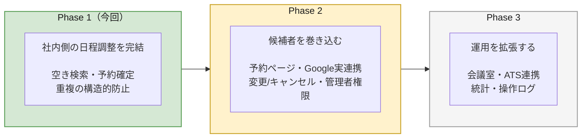

# 面接日程調整ツール 要件定義書

2026-08-31 ／ 情報源：Day 2 ヒヤリング面談 ／ 関連文書：仕様書（MVP）、別紙A（実装詳細）

## 本書の構成

Phase別に構成する。**Phase 1（MVP）が本書の主題**であり、Phase 2・3 は「今回作らないものが、いつどこに位置づくか」を示すために置く。

| | 内容 | 分量 |
|---|---|---|
| §1 | 全体像とPhase分割の考え方 | 概説 |
| **§2** | **Phase 1（MVP・今回作るもの）** | **本書の中心** |
| §3 | Phase 2（候補者を巻き込む） | 概要 |
| §4 | Phase 3（運用を拡張する） | 概要 |
| §5 | 全体機能マップ・未確定事項 | 一覧 |

---

# 1. 全体像とPhase分割

## 1-1. 解決する課題

相談者は採用面接の日程調整担当で、候補者からメールで届く希望日時に対し、社内メンバーのGoogleカレンダーを一人ずつ開いて空きを確認している。ヒヤリングで確認した困りごとは次の2点である。

- 担当者の予定ブッキングを避けたい（H-12）
- カレンダーの重複に伴う、予定管理の工数（H-12）

**この2つは同じ原因から出ている。確認と予約が分断されていることである。** 確認した瞬間から登録するまでの間、誰も空き状況を見ていない。

## 1-2. 情報源

本書の根拠は2回のヒヤリングによる。**根拠欄の記号は、どちらで得た情報かを示す。**

| 記号 | 情報源 | 形式 |
|---|---|---|
| `H-nn` | Day 2 ヒヤリング面談（30分） | 対面での質疑。質問リスト全41問のうち回答が得られた項目 |
| `H2-nn` | 追加ヒヤリング（MTG） | 面談後のフォローアップ。課題文の「面談後の追加質問はテキストで受け付けます」に相当 |
| `A-n` | 置いた仮定 | ヒヤリングで確認できず、こちらで決めた事項 |

### 追加ヒヤリング（H2）の内容

| ID | 得られた要件 | 反映先 | 元の状態 |
|---|---|---|---|
| **H2-01** | 開始時刻・所要時間を柔軟に指定したい（15分開始も、15分の面談もありうる） | BR-08 を可変方式に改訂 | **A-4（仮定）が要件に確定した** |
| **H2-02** | 簡易ログインの実装方法を仕様に明記すること | 仕様書 §6.2 に実装を記載 | 記述レベルの不足 |
| **H2-03** | カレンダー予定は、入力する挙動までを実装するに止める | F-10 の範囲を明記 | H-15 の範囲を追認 |
| **H2-04** | テナント単位での固定ブロックを仕様に明記すること | **BR-12（合成規則）を新設** | **仕様の欠落。** テナントと個人が競合したときの規則が未定義だった |
| **H2-05** | 時間で絞るのではなく、参加メンバーのカレンダー一覧を見て空き時間を探せる方が便利 | **主動線を入れ替え。** F-16 を週カレンダー方式に再定義 | **H-28（未回答）への回答に相当** |

**H2-04 と H2-05 は、こちらの設計の穴を指摘されたものである。** 前者はテナントと個人のルールが競合したときの規則を決めていなかった箇所、後者は「希望日時が全員埋まっていた場合の運用」を H-28 で質問したが回答を得られず、そのまま塞げていなかった箇所にあたる。

### H2-05 は主動線の入れ替えである（確認済み）

当初の相談文は「時間を指定したら空いているメンバーが分かって、そのまま予約できるもの」であり、H2-05 はこれと方向が異なる。**導線の追加なのか主動線の入れ替えなのかを確認し、入れ替えであることが確定した。**

| | 旧（時間 → メンバー） | **新（メンバー → 時間）** |
|---|---|---|
| 起点 | 候補者の希望日時を入力 | **面接官を選ぶ** |
| 次に見るもの | その時間に空いているメンバー一覧 | **選んだメンバーのカレンダー週表示** |
| 日時の決め方 | 先に決まっている前提 | **空いている枠を見ながら決める** |
| 希望日時が全滅した場合 | 「全員×」で行き止まり | **他の枠が同じ画面に見えている** |

**旧動線を採用しない理由**：候補者の希望日時が全員埋まっていた場合に行き止まりになり、日時を変えて検索し直す操作を当たりが出るまで繰り返すことになる。新動線では代替候補がその場で見える。

**設計への影響は画面のみ。** `AvailabilityChecker`・データモデル・排他制御はいずれも変更しない。判定は「このメンバーはこの区間に空いているか」を答えるだけで、呼び出し順序を知らないためである。

## 1-3. 到達点

> 候補者との日程のやり取り自体を消し、面接が自動的に組み上がる状態。

参照モデルは Jicoo に代表される**予約ページ共有型の日程調整ツール**である。カレンダーと接続して空き状況をリアルタイムに反映し、共有した予約ページからゲスト自身が枠を選ぶ。予約タイプの使い分け、Web会議URL発行、リマインダーまで自動化される。

## 1-4. 参照モデルと現行業務の差分

**両者は出発点が異なる。ここを混同するとスコープ判断を誤る。**

| | 現行業務（H-06） | 参照モデル |
|---|---|---|
| 日程のやり取り | メールで希望日時を受け取る | 予約ページで候補者が直接選ぶ |
| 担当者の作業 | 希望日時を手入力し、空きを確認 | 自動割当・自動確定 |
| メールのラリー | **発生する** | 発生しない |
| 担当者の関与 | 全件に必要 | 例外時のみ |

参照モデルへ一足飛びに移行することは、**現行運用そのものを置き換える**ことを意味する。

## 1-5. Phase分割

| Phase | 到達する状態 | 前提の変化 |
|---|---|---|
| **1** | 担当者が一箇所で空きを確認し、そのまま予約できる | **なし**（現行運用のまま） |
| 2 | 候補者が自分で枠を選ぶ。メールのラリーが消える | **運用が変わる。** 候補者への案内方法の変更が必要 |
| 3 | 会議室・ATSまで含めて自動化される | 他システムとの接続が前提になる |

**Phase 1 を先に置く理由**：Phase 2 は痛みを消すのではなく運用そのものを置き換える。**まず現行運用のまま痛みを消し、そのうえで運用を変える**方が、失敗したときの後戻りが小さい。ヒヤリングH-03でも予約ページは「あったら良いが、期日的に間に合うのであれば」と条件付きだった。

---
---

# 2. Phase 1（MVP・今回作るもの）

## 2-1. スコープ宣言

> 指定した時間に空いているメンバーを一覧で示し、確認から予約までを一度の操作で完結させる**社内ツール**。候補者と面接実施者は本ツールに接触しない。

## 2-2. 優先度の判定基準

ヒヤリングで「予定調整アプリで必須の要素は詰め込んで欲しい」と要望されたが、必須の定義は示されなかった。**次の3つを必須要素と定義**し、優先度の判定基準とする。

| # | 必須要素 | 判定基準 |
|---|---|---|
| **R1** | 空き状況が一覧で分かる | 一箇所で全メンバーの可否が見えるか |
| **R2** | 確認と予約が分断されない | 同一画面・同一操作で完結するか |
| **R3** | 重複が構造的に防がれる | 運用上の注意ではなく仕組みで防いでいるか |

**この定義は相談者と未合意である。** レビュー時に最初に確認する。

## 2-3. 登場人物

| 登場人物 | ツールを操作 | 空き判定の対象 | データの持ち方 |
|---|---|---|---|
| **採用担当者**（複数人） | ○ | △ 兼任しうる | `users.operator = true` |
| **面接実施者** | × | ○ | `users.interviewer = true` |
| **面談候補者** | × | × | `interviews.candidate_name`（文字列） |

**採用担当者と面接実施者を1テーブルにする理由**：採用担当者が自分で面接に出るケースがある。別テーブルにすると兼任者が2レコードに分かれ、氏名の二重管理と突き合わせが発生する。**役割ではなく「できること」をフラグで持つ。**

| | `operator` | `interviewer` |
|---|---|---|
| 採用担当で面接にも出る | true | true |
| 採用担当で調整専門 | true | false |
| 面接だけ出る社内メンバー | false | true |

**ロールの粒度**：H-02で「管理者とCA」の2ロールが挙がったが、両者の権限差は確認できていない（仮定A-6）。H-31で承諾フローが不要と明言されており、操作の制限に業務上の必然性がない。**Phase 1 では権限差を実装せず、`operator = true` の1種類として扱う。** 管理者画面の分離は Phase 2 とする。

**候補者をテーブルにしない理由**：候補者マスタは「この候補者は今どの選考段階か」という管理の入口になり、日程調整ツールから採用管理システムへ範囲が広がる。複数回選考の運用をヒヤリングできていないため、今回は文字列に留める。同一候補者の表記ゆれが起きうることは認識している。

## 2-4. 機能要件

`根拠` の `H-nn` はヒヤリング質問番号、`A-n` は仮定番号を指す。

### Must（9機能）

| ID | 機能 | 満たす要素 | 根拠 |
|---|---|---|---|
| F-01 | メンバー登録・編集・削除 | 前提 | H-24「ユーザー追加機能側で実装する」 |
| F-02 | `operator` / `interviewer` フラグ設定 | 前提 | H-02「管理者とCAがあれば良い」 |
| F-05 | 簡易ログイン（操作者の選択） | 前提 | H-02（複数人運用）／登録者の記録に必要 |
| F-10 | カレンダー予定の保持（**投入は seed と手入力のみ**） | 前提 | H-15「ダミーデータで再現して、同期された前提で進めて良い」 |
| **F-16** | **メンバーカレンダー週表示＋空き枠算出** | **R1** | 相談文の中核／**H2-05 で動線を入れ替え** |
| **F-20** | **面接予約の作成** | **R2** | 相談文の中核 |
| **F-21** | **重複の再チェック** | **R3** | H-12「担当者の予定ブッキングを避けたい」 |
| F-22 | カレンダーへの書き込み | R3 | H-15／自己ダブルブッキング防止 |
| F-24 | 予約一覧・詳細 | 前提 | 登録結果の確認手段 |

### Should（6機能）

| ID | 機能 | 位置づけ | 根拠 |
|---|---|---|---|
| F-03 | 面接官フラグによる検索対象の絞り込み | 判定精度 | A-6 |
| F-11 | 営業時間の設定 | 判定精度 | H-18「テナントでも良いし個別の設定できたら良い」 |
| F-12 | 予約不可時間の設定（個人単位） | 判定精度 | H-18「入れられない時間を設定する機能は欲しい」 |
| F-13 | 土日の自動ブロック | 判定精度 | H-18「土日は自動ブロック」 |
| F-23 | 会議URLの保持（手入力／スタブ発行） | 運用の省力化 | H-24「Google meetを送れる機能を追加」 |
| F-27 | 場所の指定（オンライン／対面） | 対面への対応 | H-27「対面で実施することもある」 |

**Must 9機能で R1〜R3 をすべて満たす。** Should は残り時間の分だけ着手し、未実装分は README に明記する。

### 実装中に追加した機能

| ID | 機能 | 経緯 |
|---|---|---|
| F-29 | カレンダー連携画面 | 設計時に定義していない。**Phase 2 のGoogle連携の受け皿として実装中に追加した。** 現状はダミーカレンダーの接続状態を表示するのみ |

## 2-5. 機能詳細

### F-16　空きメンバー検索 【Must / R1】

| 項目 | 内容 |
|---|---|
| 利用者 | 採用担当者 |
| 入力 | 日付／開始時刻（10分刻み）／所要時間（30・45・60分から選択） |
| 処理 | 対象メンバー全員に BR-01〜BR-05 を順に適用して可否を判定 |
| 出力 | メンバー**全員**の一覧。可否と、不可の場合はその理由 |
| 例外 | メンバー0名 → メンバー画面への導線 空き0名 → 全員の不可理由を表示し条件変更を促す |

**不可のメンバーも一覧から除外せず、理由を併記する。** 相談者は現在、誰がなぜ空いていないかを目視で把握しており、空いている人だけを表示するとその情報が失われる。

### F-20 / F-21　面接予約の作成と重複再チェック 【Must / R2・R3】

| 項目 | 内容 |
|---|---|
| 前提 | F-16 の検索結果が表示されている |
| 入力 | 候補者名／面接官（1〜N名）／実施方法／場所／会議URL |
| 処理 | ① トランザクション開始（書き込みロック取得） ② 選択メンバー全員に空き判定を**再実行** ③ 全員空きなら 予約・出席者・カレンダー予定 を作成 ④ コミット |
| 出力 | 成功：予約詳細へ遷移／失敗：同一画面にエラー表示 |
| 例外 | 1名でも埋まっていれば**予約全体を中止**（部分確定はしない） 必須項目の未入力時は選択状態を保持したままエラー表示 |

**再チェックが必要な理由**：検索結果の表示から予約ボタンを押すまでに時間差がある。**現行運用で重複が起きているのはまさにこの時間差が原因**であり、表示時のチェックだけでは同じ問題が再現する。

### F-22　カレンダーへの書き込み 【Must / R3】

| 項目 | 内容 |
|---|---|
| 処理 | 予約確定時、選択された各メンバーの予定として1件ずつ登録 |
| タイトル | `面接：{候補者名}様` の固定フォーマット。**編集不可** |
| データ | `source = "app"`、`interview_id` で予約に紐付け |

**Must とした理由**：予約レコードだけを保存すると、次の検索で自ツールが入れた面接が空き判定から漏れ、**自分が入れた予定に自分でダブルブッキングする。**

**タイトルを固定にした理由**：カレンダー上で面接だと一目で分かる形式に統一する。編集可能にすると「なぜ編集が必要か」の要件が別途必要になる。

### F-05　簡易ログイン 【Must】

| 項目 | 内容 |
|---|---|
| 入力 | `operator = true` のメンバーから自分を選択 |
| 処理 | セッションに `user_id` を保持。**パスワード認証は行わない** |
| 出力 | 以降 `interviews.created_by_id` に記録される |
| 対象外 | パスワード・多要素認証・権限制御（Phase 2） |

**必要な理由**：複数人運用のため、予約一覧に登録者が表示されないと「この予約は誰が入れたか」の問い合わせ先が分からない。ヒヤリングの主訴が確認ミスであることから、操作の追跡には意味がある。**一方で社内ツールであり権限差の要求も出ていないため、本格的な認証は Phase 2 とする。なりすまし可能であることは認識している。**

### F-24　予約一覧・詳細 【Must】

| 項目 | 内容 |
|---|---|
| 出力 | 候補者名／日時／面接官／実施方法／場所／会議URL／登録者 |
| 並び順 | 開始日時の昇順。**既定は今後の面接のみ** |
| 絞り込み | **登録者では絞り込まない。全件を共有表示する** |
| 対象外 | 検索・期間指定・変更・キャンセル（Phase 2） |

**全件を共有表示する理由**：H-02で「自分の予定でなくても誰でも入れられるようにしたい」とあり、担当者間で共有する前提。自分の分しか見えないと代理対応ができない。`created_by_id` は記録と表示のために保持し、絞り込みには使用しない。

**過去の面接について**：一覧からは消えるが、データとカレンダー上の占有は残る。**過去分を参照する画面は作っていない。** H-36「予約した内容は、後から誰が見返しますか」が未回答で、必要性を判断できなかったため。

### F-11 / F-12 / F-13　予約不可時間 【Should】

| 項目 | 内容 |
|---|---|
| 入力 | 適用範囲（全体／個人）／曜日／時間帯／種別（allow・block）／表示ラベル |
| 処理 | F-16 の判定時に BR-04・BR-05 として適用 |
| 初期値 | 平日 10:00〜18:00 を allow、土日は allow なし |

ラベルは不可理由の表示にそのまま使う（「予約不可時間（昼休み）」）。

## 2-6. 業務ルール

| ID | ルール | 根拠 |
|---|---|---|
| BR-01 | 既存予定と要求区間が重なる場合は不可。判定は `既存開始 < 要求終了 かつ 既存終了 > 要求開始` | 区間重なりの標準判定 |
| BR-02 | 予定の終了時刻と要求の開始時刻が一致する場合（隣接）は**空きとする** | A-8（バッファなし） |
| BR-03 | 終日予定がある日は、その日全体を不可とする | A-7 |
| BR-04 | 要求区間は営業時間内に**完全に収まる**こと | H-18 |
| BR-05 | 土曜・日曜は不可とする | H-18 |
| BR-06 | 予約確定の直前に空き判定を再実行し、**1名でも不可なら予約全体を中止**する | H-12 |
| BR-07 | 面接官の承諾を待たず、予約は即時に確定する | H-31「確定で良い！」 |
| BR-08 | **開始時刻は5分刻みで自由に指定できる。所要時間は分単位で自由に指定できる**（プリセットは入力補助であり制約ではない） | H-26／H2-01「15分開始や15分の面談もありうる」 |
| BR-09 | 「予定あり」は一律で不可とし、調整可能かは判定しない | A-1（H-17 未回答） |
| BR-10 | 同一メンバーを1つの面接に重複して指定できない | DB側のユニーク制約で担保 |
| BR-11 | 予約のタイトルは `面接：{候補者名}様` で固定 | 自己判断（カレンダー上の識別性） |
| BR-12 | **`allow` はテナントの範囲が上限。個人 `allow` があれば積集合で絞る。`block` はテナントと個人の和集合。** 個人設定でテナントの制限を緩めることはできない | H-18／H2-04 |

**BR-08の経緯**：当初は「開始10分刻み・所要時間は30／45／60分の3択」としていたが、**粒度が一貫していないという指摘を受け（H2-01）、両方とも固定値を持たない方式に改めた。** 開始時刻の刻みを5分にすれば10分刻みも15分刻みも表現でき、**設定機能を作らずに柔軟性が得られる。** 判定ロジックは開始・終了時刻を受け取るのみで刻みの概念を持たないため、影響はUIの入力方式に限られる。

## 2-7. 置いた仮定

| # | 未確認の項目 | 置いた仮定 | 影響 |
|---|---|---|---|
| A-1 | 予定あり＝呼べない、でよいか | 一律で不可（BR-09） | F-16 の判定の根幹 |
| A-2 | 1回の面接に何名出るか | 1〜N名を選択可能 | F-20 |
| A-3 | 予約ボタンで何が起きるか | 予約作成＋カレンダー書き込み＋URL保持。**メール送信は含めない** | F-22 |
| A-4 | 面接の所要時間 | **固定せず自由入力**（プリセットは15／30／45／60／90分） | BR-08 |
| A-5 | 成功の定義 | 重複0件と、空き確認時間の削減 | 優先順位全体 |
| A-6 | 管理者とCAの役割差 | 権限差を実装しない | F-02、管理者画面の Phase 2 送り |
| A-7 | 終日予定の扱い | その日全体を不可 | BR-03 |
| A-8 | 面接前後のバッファ | なし | BR-02 |

## 2-8. 非機能要件

| 区分 | 要件 | 水準の考え方 |
|---|---|---|
| 性能 | メンバー50名の空き検索を1秒以内 | 現行は人手で数分。**要件として意味を持つのは、メンバー増加時にN+1で劣化しないこと** |
| 同時利用 | 数名 | H-02（採用担当者のみ） |
| データ量 | メンバー数十名、予約は年間数百件 | H-11 未回答のため暫定 |
| 可用性 | 平日日中の業務時間内 | 社内ツールのため冗長構成は不要 |
| セキュリティ | **本番データを扱わない**（全てダミー）ため、認証・アクセス制御の要件が発生しない。Phase 2 で実装 | H-04 未確認 |
| 保守性 | 空き判定を単一クラスに集約し、境界条件を単体テストで担保 | 判定が分散すると片方だけ修正されて食い違う |
| 移行性 | SQLite で開始し、PostgreSQL へ移行可能な設計 | 別紙A |
| 国際化 | 日本語・JST固定 | 社内利用のため |

---
---

# 3. Phase 2（候補者を巻き込む）

## 3-1. 目的

**候補者を予約プロセスに参加させ、メールのラリーを消す。** Phase 1 が現行運用の痛みを取り除くのに対し、Phase 2 は運用そのものを変える。

## 3-2. 含む機能

| ID | 機能 | 概要 |
|---|---|---|
| F-04 | 面接官の属性設定 | 職種・役職・担当領域による絞り込み |
| F-14 | 祝日の自動ブロック | 祝日マスタを参照 |
| F-15 | 前後バッファの設定 | 面接前後に確保する時間 |
| F-17 | 空き枠の推薦・並び替え | 候補枠を優先度順に並べる、負荷分散を考慮するなど（MVPは全枠を等価に表示） |
| F-18 | 「動かせる予定」のグレー表示 | A-1 が覆った場合に必要 |
| F-25 | 予約の変更 | 日時・面接官の変更 |
| F-26 | 予約のキャンセル | カレンダーからの連動削除 |
| F-30 | 予約ページの発行 | 候補者に共有するURL |
| F-31 | 候補者による枠選択 | 候補者が自分で枠を選ぶ |
| F-32 | 仮押さえと確定 | 選択中の枠を一時的に押さえる |
| F-33 | 候補者への確認メール | 予約確定を自動送信 |
| F-40 | 面接官への通知 | メール／Slack |
| F-41 | Googleカレンダー双方向同期 | OAuth連携 |
| F-52 | 認証・権限制御 | **管理者画面の分離を含む** |

## 3-3. このPhaseで発生する設計変更

| 変更 | 影響 |
|---|---|
| **書き込み経路が2本になる** | 候補者からの予約が加わり、SQLiteの「経路1本」の前提が崩れる。**PostgreSQL移行と排他制約の導入が必要**（仕様書§5-3） |
| **`interviews.status` の追加** | 仮押さえ（pending）と確定（confirmed）の区別が必要。「確定で良い」の前提が変わる |
| **`calendar_events.external_event_id` の追加** | Google側のイベントIDを保持しないと、キャンセル時にGoogle側を削除できない |
| **外部APIとトランザクション境界** | Googleへの書き込みはDBトランザクションに含められない。**判定の正をローカルに置き続け、Google反映は非同期＋再送**とする（仕様書§10） |
| **`users` にロール列の追加** | 管理者画面の分離。ただし**権限差の定義をヒヤリングで確定させることが前提** |

## 3-4. 前提として確認が必要なこと

- 候補者への案内方法をどう変えるか（運用変更を伴う）
- 連絡文面のテンプレート（H-35 未回答）
- 予約の変更・キャンセルの頻度（H-32・H-33 未回答）
- 管理者とCAの権限差（H-02 で挙がったが未確認）

---
---

# 4. Phase 3（運用を拡張する）

## 4-1. 目的

**他システムと接続し、日程調整の前後まで含めて自動化する。**

## 4-2. 含む機能

| ID | 機能 | 概要 | 前提 |
|---|---|---|---|
| F-28 | 会議室の予約 | 会議室を空き判定の対象リソースとして扱う | 会議室管理の運用確認（H-27 未確認） |
| F-34 | リマインドメール | 面接前日などに自動送信 | F-33 の実装 |
| F-42 | ATS連携 | 候補者情報を採用管理システムから取得 | ATSの導入と API の有無 |
| F-50 | 操作ログ | 誰がいつ予約を作成・変更したか | — |
| F-51 | 統計 | 調整件数・所要時間の可視化 | A-5（成功指標）の確定 |

## 4-3. このPhaseで発生する設計変更

| 変更 | 影響 |
|---|---|
| **`AvailabilityChecker` の対象を一般化** | User だけでなく「会議室」も空き判定の対象になる。**リソースという抽象を導入する** |
| **候補者テーブルの切り出し** | ATS連携時に候補者IDでの突合が必要になり、文字列では扱えなくなる |

---
---

# 5. 全体機能マップと未確定事項

## 5-1. 全体機能マップ（全34機能）

| 領域 | ID | 機能 | Phase |
|---|---|---|---|
| メンバー | F-01 | メンバー登録・編集・削除 | **1** |
| | F-02 | `operator`／`interviewer` フラグ設定 | **1** |
| | F-03 | 面接官フラグによる絞り込み | **1** |
| | F-04 | 面接官の属性設定 | 2 |
| | F-05 | 簡易ログイン | **1** |
| カレンダー | F-10 | カレンダー予定の保持 | **1** |
| | F-11 | 営業時間の設定 | **1** |
| | F-12 | 予約不可時間の設定 | **1** |
| | F-13 | 土日の自動ブロック | **1** |
| | F-14 | 祝日の自動ブロック | 2 |
| | F-15 | 前後バッファの設定 | 2 |
| | F-16 | **空きメンバー検索** | **1** |

| | F-18 | 「動かせる予定」のグレー表示 | 2 |
| 予約 | F-20 | **面接予約の作成** | **1** |
| | F-21 | **重複の再チェック** | **1** |
| | F-22 | カレンダーへの書き込み | **1** |
| | F-23 | 会議URLの保持 | **1** |
| | F-24 | 予約一覧・詳細 | **1** |
| | F-25 | 予約の変更 | 2 |
| | F-26 | 予約のキャンセル | 2 |
| | F-27 | 場所の指定 | **1** |
| | F-28 | 会議室の予約 | 3 |
| | F-29 | カレンダー連携画面 | **1**（実装中に追加） |
| 候補者接点 | F-30 | 予約ページの発行 | 2 |
| | F-31 | 候補者による枠選択 | 2 |
| | F-32 | 仮押さえと確定 | 2 |
| | F-33 | 候補者への確認メール | 2 |
| | F-34 | リマインドメール | 3 |
| 通知・連携 | F-40 | 面接官への通知 | 2 |
| | F-41 | Googleカレンダー双方向同期 | 2 |
| | F-42 | ATS連携 | 3 |
| 運用・管理 | F-50 | 操作ログ | 3 |
| | F-51 | 統計 | 3 |
| | F-52 | 認証・権限制御（管理者画面を含む） | 2 |

**Phase 1 は16機能（Must 9／Should 6／実装中追加 1）、Phase 2 は14機能、Phase 3 は5機能。**

## 5-2. Phase 1 で外した主要機能と理由

| 外した機能 | 理由 |
|---|---|
| **F-30〜F-33 候補者向け予約ページ** | H-03で「あったら良いが、期日的に間に合うのであれば」と条件付き。公開URL・仮押さえ状態・排他制御が芋づる式に必要になり、想定工数の大半を消費する。**中核（F-16・F-20・F-21）を確実に動かす方を優先した** |
| F-41 Googleカレンダー実連携 | H-15で「ダミーデータで再現して良い」と合意済み。`source` カラムにより差し替え可能な形にしてある |
| F-52 認証・権限制御 | 本番データを扱わずセキュリティ要件が発生しない。管理者とCAの権限差も未確認 |
| F-28 会議室の予約 | H-27で対面もあると判明したが会議室の要否は未確認。押さえるリソースが人＋場所の2種類になり、判定ロジックが倍の複雑さになる |
| F-04 面接官の属性フィルタ | H-24で質問したが条件の言及がなく、「誰でもよい」と解釈 |
| F-25・F-26 変更・キャンセル | H-32・H-33 未回答。作成が動かなければ変更する対象も存在しない |
| F-42 ATS連携 | H-06「手動で入力する想定で良い」 |

**絞った判断の根幹**：使える時間の大半を、候補者向け予約ページという「範囲の広い機能」ではなく、空き判定と重複防止という「痛みの中心」に投じた。前者は現状ゼロから増える利便性だが、後者は現に毎回発生している損失を消す。

## 5-3. 未確定事項

**レビュー時に優先的に確認する。**

| # | 確認したいこと | 現在の仮定 | 影響 | 優先度 |
|---|---|---|---|---|
| 1 | §2-2 の必須要素3項目に相違はないか | 相違なし | スコープ判断の前提そのもの | 高 |
| 2 | 動かせる予定はあるか（A-1） | 一律で不可 | F-16 の判定の根幹 | 高 |
| 3 | 予約時に候補者へのメール送信まで期待するか（A-3） | 送信しない | スコープが1機能分変わる | 高 |
| 4 | 何が減れば成功と言えるか（A-5） | 重複0件と時間削減 | 優先順位全体 | 高 |
| 5 | 1回の面接に何名出るか（A-2） | 1〜N名 | F-20 の実装方式 | 中 |
| 6 | 管理者とCAの権限差 | 差なし | Phase 2 の F-52 の設計 | 中 |
| 7 | 対面時に会議室の予約も期待するか | 期待しない | F-28 の要否 | 中 |
| 8 | 予約内容を後から誰が見返すか（H-36） | 見返さない | 過去分の参照画面の要否 | 中 |
| 9 | 週あたりの調整件数・メンバー総数 | 数十名・年間数百件 | 非機能要件の水準 | 低 |

### 追加ヒヤリングで解消した項目

| 元の未確定事項 | 解消の経緯 |
|---|---|
| 面接の所要時間は何分か（A-4） | **H2-01 で解消。** 固定値を持たず自由入力とする方針が確定した |
| その時間に全員埋まっているときの運用（H-28） | **H2-05 で部分的に解消。** カレンダー一覧を見て探したいという要望として回答が得られた |
| テナントと個人のルールが競合したときの規則 | **H2-04 で解消。** テナント優先（allowは積集合、blockは和集合）と定義した |
| H2-05 は導線追加か主動線の入れ替えか | **確認済み。主動線の入れ替えである。** F-16 を週カレンダー方式に再定義した |

## 5-4. 用語定義

| 用語 | 定義 |
|---|---|
| 空き | BR-01〜BR-05 のすべてを満たし、面接を入れられる状態 |
| 要求区間 | 検索時に指定した「開始時刻〜開始時刻＋所要時間」の時間帯 |
| 外部予定 | Googleカレンダー由来の予定（Phase 1 ではダミー）。`source = "external"` |
| 自ツール予定 | 本ツールが予約確定時に作成した予定。`source = "app"` |
| 予約不可時間 | 営業時間内であっても面接を入れない時間帯（昼休み・定例会議など） |
| 操作者 | セッションにログインしている採用担当者。`interviews.created_by_id` に記録される |
